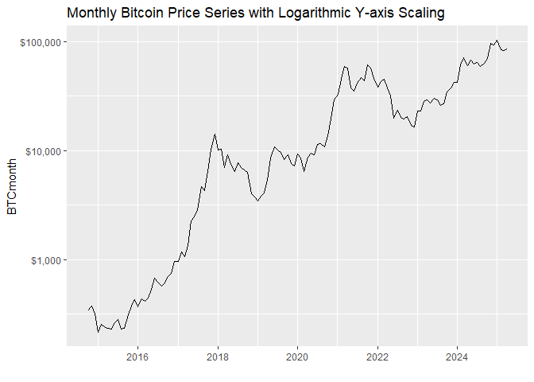
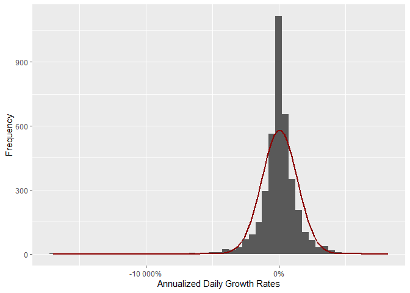
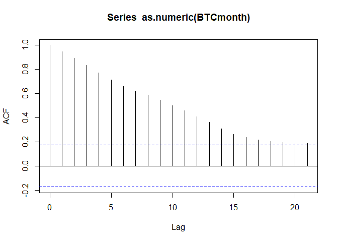
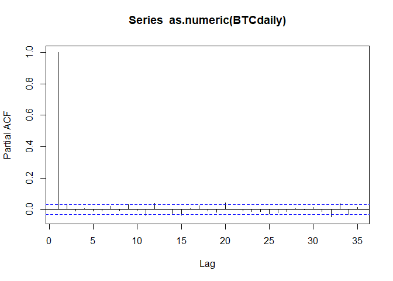
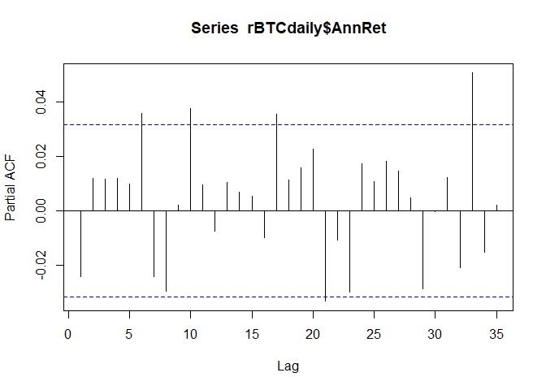
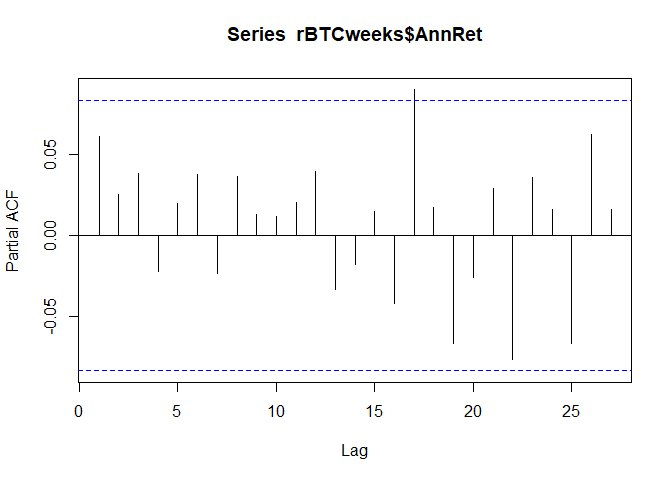
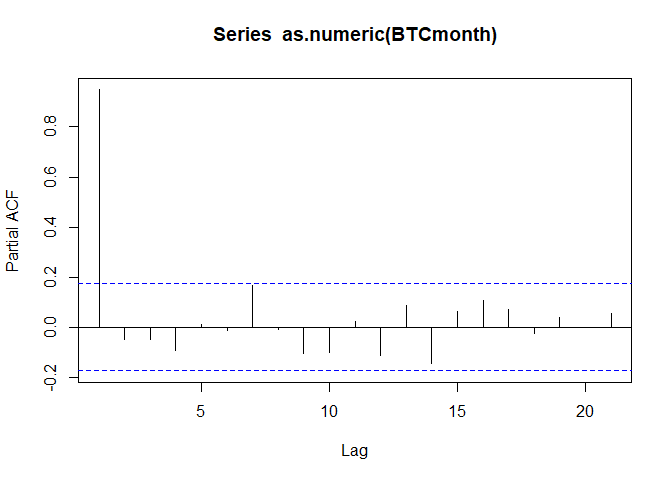
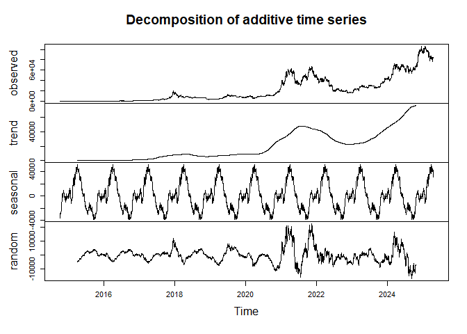

Bitcoin Price Time Series Analysis
================
Last updated: 2024-04-14

## Preliminary Work: Install/Load Packages

To try and ensure that this R Notebook will run successfully, we’ll use
the [renv
package](https://cran.r-project.org/web/packages/renv/index.html) to
create a project-specific library of packages. This will allow us to
install the packages that we need for this project without affecting any
other projects that we may be working on. Additionally, the project
library will track the specific versions of the dependency packages so
that any updates to those packages will not break this project.

The code chunk below will first install the renv package if it is not
already installed. Then we will load the package. Next, we’ll use the
`restore()` function to install any packages listed in the renv.lock
file. Once these packages are installed, we can load them into the R
session using the `library()` commands. Below the code chunk, we’ll list
out the packages that will be used in the project demo. And if you run
into any trouble using renv, then you can use the second code chunk
below and that should be an even more reliable approach to install the
required packages.

``` r
# Install renv package if not already installed
if(!"renv" %in% installed.packages()[,"Package"]) install.packages("renv")
# Load renv package
library(renv)
# Use restore() to install any packages listed in the renv.lock file
renv::restore(clean=TRUE, lockfile="../renv.lock")
# Load in the packages
library(quantmod)
library(tseries)
library(ggplot2)
library(seasonal)
library(seasonalview)
library(rmarkdown)
library(stringr)
```

- The [quantmod package](https://cran.r-project.org/package=quantmod)
  contains tools for importing and analyzing financial data.
- The [ggplot2 package](https://cran.r-project.org/package=ggplot2) for
  graphics and visuals.
- The [tseries package](https://cran.r-project.org/package=tseries)
  contains additional time series analysis functions that we will
  explore.
- The [seasonal package](https://cran.r-project.org/package=seasonal)
  contains an interface to the [Census X-13-ARIMA-SEATS
  model](https://www.census.gov/data/software/x13as.html).
- The [seasonalview
  package](https://cran.r-project.org/package=seasonalview) brings a
  graphical user interface to that Census model.
- The [rmarkdown package](https://cran.r-project.org/package=rmarkdown)
  is used to generate this R Notebook.
- The [stringr package](https://cran.r-project.org/package=stringr) is
  another package used by R Markdown to compile R Notebooks.

Since the rmarkdown functionality is built into RStudio, this last one
is automatically loaded when you open RStudio. So no need to use the
`library()` function for it. Another observation to make about the code
chunk above is that it is labeled as `setup`, which is a special name,
which the R Notebook will recognize and automatically run prior to
running any other code chunk. This is useful for loading in packages and
setting up other global options that will be used throughout the
notebook.

Then if you wish to try and update the versions of the various R
packages in the lock file, you can use the `renv::update()` function to
update the packages in the project library. However, it is possible that
these updates could break the code in this notebook. If so, you may need
to adapt the code to work with the updated packages.

My recommendation is to first run through the code using the versions of
the packages in the lock file. Then if you want to try and update the
packages, you can do so and then run through the code again to see if it
still works. If not, you can always revert back to the lock file
versions using the `renv::restore()` function.

If you update the packages and get everything working successfully, then
you can update the lock file using the `renv::snapshot()` function. This
will update the lock file with the versions of the packages that are
currently installed in the project library. Then you can commit the
updated lock file to the repository so that others can use the updated
versions of the packages.

### Alternative Package Installation Code

If you run into any trouble using renv in the code chunk above, then you
can use the code chunk below to install the required packages for this
analysis. This method will first check if you have already installed the
packages. If any are missing, it will then install them. Then it will
load the packages into the R session. A potential flaw in this approach
compared to using renv is that it will simply install the latest
versions of the packages, which could potentially break some of the code
in this notebook if any of the updates aren’t backwards compatible.

As long as you have downloaded the entire project repository, the renv
chunk above will likely be managing the packages. Thus, the `eval=FALSE`
option is used to prevent this chunk from running unless manually
executed. So if you only downloaded this one Rmd file, this code chunk
should take care of installing the packages for you.

``` r
# Create list of packages needed for this exercise, omit geckor since its not on CRAN
list.of.packages = c("quantmod","ggplot2","tseries","seasonal","seasonalview","rmarkdown","stringr")
# Check if any have not yet been installed
new.packages = list.of.packages[!(list.of.packages %in% installed.packages()[,"Package"])]
# If any need to be installed, install them
if(length(new.packages)) install.packages(new.packages)
# Since geckor is no longer published to CRAN, install via GitHub
library(quantmod)
library(tseries)
library(ggplot2)
library(seasonal)
library(seasonalview)
library(rmarkdown)
library(stringr)
```

## Bitcoin Data Import and Cleaning

The `getSymbols()` function from the quantmod package let’s use import
the daily price data for bitcoin. The `src="yahoo"` argument specifies
that we want to pull the data from Yahoo Finance. The `from` and `to`
arguments specify the date range for the data, which goes back to
October 2014 for bitcoin. Rather that assigning a variable name to the
output of `getSymbols()`, the function creates a new variable for each
ticker in the list, named after the ticker. For bitcoin in particular,
the `"BTC-USD"` can be tedious to work with since the presence of a dash
requires one to wrap the variable name in backticks. This is resolved in
the last line of the code chunk below by creating a new variable `BTC`
to be used instead.

``` r
startdate = "2014-10-01"
tickers = c("BTC-USD")
getSymbols(tickers,
           src="yahoo",
           from=startdate,
           to=Sys.Date())
BTC = `BTC-USD`
```

Now that we have the daily bitcoin price series, let’s extract the close
prices into a univariate xts object. Then we can rename the column to
`"Close"` to keep variable names simple. After that, let’s aggregate the
daily prices to weekly and monthly series to compare the time series
properties at different frequencies. The xts package (which is a
dependence of quantmod) allows us to easily convert the daily price data
into weekly or monthly OHLC series using `to.weekly()` and
`to.monthly()`. The `name=NULL` option in those functions prevents the
variable names from including the name of the original object. So
instead of ``` BTCweeksOHLC2$``BTCdaily$Close.Close`` ```, we can just
use `BTCweeksOHLC$Close`.

``` r
# Create daily series and rename column
BTCdaily = BTC$`BTC-USD.Close` 
names(BTCdaily) = "Close"
# Convert to weekly and monthly series
BTCweeksOHLC = to.weekly(BTCdaily$Close, name=NULL)
BTCweeks = BTCweeksOHLC$Close
BTCmonthOHLC = to.monthly(BTCdaily$Close, name=NULL)
BTCmonth = BTCmonthOHLC$Close
```

## Exploring the Full Bitcoin Price Series

### Basic Price Charts

We’ll start with some simple plots of the BTC price series that we
downloaded. Starting with the daily chart, then weekly and monthly.

``` r
ggplot() +
  geom_line(aes(x=index(BTCdaily),y=BTCdaily)) +
  xlab("") +
  ggtitle("Daily Bitcoin Price Series (Oct. 2014 - present)")
```

    ## Don't know how to automatically pick scale for object of type <xts/zoo>.
    ## Defaulting to continuous.

<!-- -->

``` r
ggplot() +
  geom_line(aes(x=index(BTCweeks),y=BTCweeks)) +
  xlab("") +
  ggtitle("Weekly Bitcoin Price Series (Oct. 2014 - present)")
```

    ## Don't know how to automatically pick scale for object of type <xts/zoo>.
    ## Defaulting to continuous.

<!-- -->

``` r
ggplot() +
  geom_line(aes(x=index(BTCmonth),y=BTCmonth)) +
  xlab("") +
  ggtitle("Monthly Bitcoin Price Series (Oct. 2014 - present)")
```

    ## Warning: The `trans` argument of `continuous_scale()` is deprecated as of ggplot2 3.5.0.
    ## ℹ Please use the `transform` argument instead.
    ## This warning is displayed once every 8 hours.
    ## Call `lifecycle::last_lifecycle_warnings()` to see where this warning was
    ## generated.

    ## Don't know how to automatically pick scale for object of type <xts/zoo>.
    ## Defaulting to continuous.

<!-- -->

### Log Price Charts

In regard to statistical analysis of time series data, one drawback of
the price series above is that they are non-stationary. This will be
explored in more detail below, but it is visually depicted in the plots
above through the observation that the mean value of the series is not
constant over time. To resolve this, we can convert the price series to
a stationary process by effectively taking its derivative. By using log
returns, we effectively assume continuous compounding of the price
series, which reflects the 24/7 365 nature of cryptocurrency markets.

$$r_t = \ln(P_t) - \ln(P_{t-1}) = \ln\left(\dfrac{P_t}{P_{t-1}}\right)$$

The first step in calculating continuously compounded growth rates is to
take the natural logarithm of the prices. To visualize this
transformation, let’s apply two approaches for plotting out the logged
price charts. The first approach is to simply compute the log(prices)
within the ggplot specifications:

``` r
ggplot() +
  geom_line(aes(x=index(BTCdaily), y=log(BTCdaily))) +
  xlab("") +
  ggtitle("Daily Bitcoin Log Price Series (Oct. 2014 - present)")
```

    ## Don't know how to automatically pick scale for object of type <xts/zoo>.
    ## Defaulting to continuous.

<!-- -->

``` r
ggplot() +
  geom_line(aes(x=index(BTCweeks), y=log(BTCweeks))) +
  xlab("") +
  ggtitle("Weekly Bitcoin Log Price Series (Oct. 2014 - present)")
```

    ## Don't know how to automatically pick scale for object of type <xts/zoo>.
    ## Defaulting to continuous.

<!-- -->

``` r
ggplot() +
  geom_line(aes(x=index(BTCmonth), y=log(BTCmonth))) +
  xlab("") +
  ggtitle("Monthly Bitcoin Log Price Series (Oct. 2014 - present)")
```

    ## Don't know how to automatically pick scale for object of type <xts/zoo>.
    ## Defaulting to continuous.

<!-- -->

Alternatively, we can generate the same charts by instead plotting the
non-logged price series with a logarithmic y-axis. This is done in
`ggplot` with the `scale_y_continuous(transform='log10')` setting.

``` r
ggplot() +
  geom_line(aes(x=index(BTCdaily), y=BTCdaily)) +
  scale_y_continuous(transform='log10') +
  xlab("") +
  ggtitle("Daily Bitcoin Price Series with Logarithmic Y-axis Scaling")
```

<!-- -->

``` r
ggplot() +
  geom_line(aes(x=index(BTCweeks), y=BTCweeks)) +
  scale_y_continuous(transform='log10') +
  xlab("") +
  ggtitle("Weekly Bitcoin Price Series with Logarithmic Y-axis Scaling")
```

<!-- -->

``` r
ggplot() +
  geom_line(aes(x=index(BTCmonth), y=BTCmonth)) +
  scale_y_continuous(transform='log10') +
  xlab("") +
  ggtitle("Monthly Bitcoin Price Series with Logarithmic Y-axis Scaling")
```

<!-- -->

### Log Return Charts

Lastly, we’ll finish the price to return conversion by differencing the
log prices. This can be done directly by composing the `diff()` and
`log()` functions. The `log()` function will take the natural logarithm
of the prices, and then the `diff()` function will subtract the previous
period’s value from the current period’s value. Then to make the series
more comparable, we’ll annualize the returns by multiplying by 365 (for
daily), 52 (for weekly), and 12 (for monthly). Lastly, we’ll adjust the
units to percentages and delete the first observations of each since
those are `NA` due to the differencing.

``` r
# Create data frames with date column
rBTCdaily = data.frame(Date=index(BTCdaily))
rBTCweeks = data.frame(Date=index(BTCweeks))
rBTCmonth = data.frame(Date=index(BTCmonth))
# Compute log returns
rBTCdaily$Return = diff(log(BTCdaily))
rBTCweeks$Return = diff(log(BTCweeks))
rBTCmonth$Return = diff(log(BTCmonth))
# Annualize returns and shift units to percentages
rBTCdaily$AnnRet = rBTCdaily$Return*100*365
rBTCweeks$AnnRet = rBTCweeks$Return*100*52
rBTCmonth$AnnRet = rBTCmonth$Return*100*12
# Remove first row of each data frame (missing due to differencing)
rBTCdaily = rBTCdaily[-1,]
rBTCweeks = rBTCweeks[-1,]
rBTCmonth = rBTCmonth[-1,]
```

With these return series, we resolve much of the non-stationarity
present in the price series. With a more stationary process like
returns, a better way to plot the data is with a bar chart. The average
bar height (red dashed line) represents the average annual return.

``` r
ggplot(rBTCdaily,aes(x=Date,y=AnnRet))+
  geom_col()+
  geom_hline(yintercept=mean(rBTCdaily$AnnRet), linetype='dashed', col='red')+
  xlab("") +
  ggtitle("BTC Annualized Daily Returns")
```

    ## Don't know how to automatically pick scale for object of type <xts/zoo>.
    ## Defaulting to continuous.

<!-- -->

``` r
ggplot(rBTCweeks,aes(x=Date,y=AnnRet))+
  geom_col()+
  geom_hline(yintercept=mean(rBTCdaily$AnnRet), linetype='dashed', col='red')+
  xlab("") +
  ggtitle("BTC Annualized Weekly Returns")
```

    ## Don't know how to automatically pick scale for object of type <xts/zoo>.
    ## Defaulting to continuous.

<!-- -->

``` r
ggplot(rBTCmonth,aes(x=Date,y=AnnRet))+
  geom_col()+
  geom_hline(yintercept=mean(rBTCmonth$AnnRet), linetype='dashed', col='red')+
  xlab("") +
  ggtitle("BTC Annualized Monthly Returns")
```

    ## Don't know how to automatically pick scale for object of type <xts/zoo>.
    ## Defaulting to continuous.

<!-- -->

### Summary Statistics

In summarizing the return series, we can compare across the various
frequencies. Since we annualized each series for their respective
frequencies, the means of each series represent the average annual
returns.

``` r
meanAnnRets = data.frame(BTCdaily=mean(rBTCdaily$AnnRet), 
                         BTCweeks=mean(rBTCweeks$AnnRet), 
                         BTCmonth=mean(rBTCmonth$AnnRet))
meanAnnRets |> round(digits=2)
```

    ##   BTCdaily BTCweeks BTCmonth
    ## 1     53.6    55.39    55.16

However, from the volatilities (as measured by standard deviation of the
return series), we can see that the higher frequencies produce larger
standard deviations.

``` r
meanRetVols = data.frame(BTCdaily=sd(rBTCdaily$AnnRet), 
                         BTCweeks=sd(rBTCweeks$AnnRet), 
                         BTCmonth=sd(rBTCmonth$AnnRet))
meanRetVols |> round(digits=2)
```

    ##   BTCdaily BTCweeks BTCmonth
    ## 1  1353.75   513.48   247.25

One way to visualize the empirical distribution summarized by the mean
and standard deviation is to plot a frequency histogram of the return
series overlayed with a normal bell curve transformed by the empirical
mean and standard deviation. The below code chunk first selects a
reasonable bin width (`bw`) for each frequency (trial and error), then
saves a count of non-missing observations, and generates the plot
described above.

``` r
# Set desired binwidth and number of non-missing obs
bw = 500
n_daily = nrow(rBTCdaily)
# Plot histogram of annualized returns and overlay graph of normal bell curve with same means and standard deviation
ggplot(rBTCdaily,aes(AnnRet)) +
  geom_histogram(binwidth=bw) +
  stat_function(fun=function(x) dnorm(x, mean=mean(rBTCdaily$AnnRet),   
                                      sd=sd(rBTCdaily$AnnRet))*n_daily*bw, 
                color="darkred", linewidth=1) +
  xlab("Annualized Daily Growth Rates") +
  ylab("Frequency")
```

    ## Don't know how to automatically pick scale for object of type <xts/zoo>.
    ## Defaulting to continuous.

<!-- -->

``` r
bw = 100
n_weeks = nrow(rBTCweeks)
ggplot(rBTCweeks,aes(AnnRet)) +
  geom_histogram(binwidth=bw) +
  stat_function(fun=function(x) dnorm(x, mean=mean(rBTCweeks$AnnRet),
                                      sd=sd(rBTCweeks$AnnRet))*n_weeks*bw, 
                color="darkred", linewidth=1) +
  xlab("Annualized Weekly Growth Rates") +
  ylab("Frequency")
```

    ## Don't know how to automatically pick scale for object of type <xts/zoo>.
    ## Defaulting to continuous.

<!-- -->

``` r
bw = 50
n_month = nrow(rBTCmonth)
ggplot(rBTCmonth,aes(AnnRet)) +
  geom_histogram(binwidth=bw) +
  stat_function(fun=function(x) dnorm(x, mean=mean(rBTCmonth$AnnRet),   
                                      sd=sd(rBTCmonth$AnnRet,))*n_month*bw, 
                color="darkred", linewidth=1) +
  xlab("Annualized Monthly Growth Rates") +
  ylab("Frequency")
```

    ## Don't know how to automatically pick scale for object of type <xts/zoo>.
    ## Defaulting to continuous.

<!-- -->

The plots above show how the daily and weekly return series more closely
resemble the fitted bell curves. However, they do tend to have more tail
events than would be suggested by a normally distributed return series.

## Time Series Stationarity, Autocorrelation, and the Dickey-Fuller Test

A [Stationary](https://en.wikipedia.org/wiki/Stationary_process)
[Process](https://www.itl.nist.gov/div898/handbook/pmc/section4/pmc442.htm)
is one that has a constant mean, variance, and autocorrelation structure
over time. A [Non-Stationary
Process](https://www.investopedia.com/articles/trading/07/stationary.asp)
can have different aspects of non-stationarity, and financial variables
often exhibit those types of trends. As we could visually see from the
price and return plots, the prices had a clear upward trend over the
long-run, whereas the return series exhibited ‘flatter’ dynamics. A more
explicit way to visualize the autocorrelation structure of the time
series is to examine its [autocorrelation function
(ACF)](https://www.itl.nist.gov/div898/handbook/eda/section3/autocopl.htm).
The ACF effectively measures the correlation between $e_t$ and
$e_{t−1}$, and then for $e_t$ and $e_{t−2}$, and so on for as many lags
as desired. In each frequency, the price series exhibits substantial
autocorrelation, and the return series shows that much of it is
resolved, although there still are a few lags that exceed the error
bands.

``` r
acf(as.numeric(BTCdaily))
```

<!-- -->

``` r
acf(rBTCdaily$AnnRet)
```

<!-- -->

``` r
acf(as.numeric(BTCweeks))
```

<!-- -->

``` r
acf(rBTCweeks$AnnRet)
```

<!-- -->

``` r
acf(as.numeric(BTCmonth))
```

<!-- -->

``` r
acf(rBTCmonth$AnnRet)
```

<!-- -->

The [partial autocorrelation function
(PACF)](https://www.itl.nist.gov/div898/handbook/pmc/section4/pmc4463.htm)
is similar to the ACF, except it produces the estimates of each lag
after controlling for all shorter lags. In other words, rather than
measuring the correlation between $e_t$ and $e_{t−2}$, we’d measure the
linear regression coefficient for the second lag from a regression
including both the first and second lags. A notable feature here from
the price series is a very large (nearly 1) estimate, which follows from
the large autocorrelation. Then subsequent lags often fall within the
error bands, although some lags do exceed them. After converting to
returns, the PACF’s have a much more condensed y-axis, which reflects
the lower autocorrelation in the return series. Although, there
certainly are still some lags that cross the error bands for the daily
and weekly series.

``` r
pacf(as.numeric(BTCdaily))
```

<!-- -->

``` r
pacf(rBTCdaily$AnnRet)
```

<!-- -->

``` r
pacf(as.numeric(BTCweeks))
```

<!-- -->

``` r
pacf(rBTCweeks$AnnRet)
```

<!-- -->

``` r
pacf(as.numeric(BTCmonth))
```

<!-- -->

``` r
pacf(rBTCmonth$AnnRet)
```

<!-- -->

From the ACF and PACF, we can gather some visual evidence to support the
suggestion that the price series suffers from autocorrelation
(non-stationarity) and that the return series is stationary. To
explicitly test for this, the
[Augmented](https://en.wikipedia.org/wiki/Augmented_Dickey%E2%80%93Fuller_test)
[Dickey-Fuller](https://www.rdocumentation.org/packages/aTSA/versions/3.1.2/topics/adf.test)
[Test](https://cran.r-project.org/web/packages/tseries/tseries.pdf)
allows us to construct a null hypothesis of non-stationarity, which
implies that rejection of the null concludes stationarity. The
`adf.test()` function comes from the `tseries` R package and generates
the test statistic (Dickey-Fuller in the output) and p-value. We can see
that the price series have smaller (in magnitude) test statistics that
fail to reject the null, and then the return series produce larger (in
magnitude) test statistics that reject the null and conclude that the
return series are a stationary process.

``` r
adf.test(as.numeric(BTCdaily))
```

    ## 
    ##  Augmented Dickey-Fuller Test
    ## 
    ## data:  as.numeric(BTCdaily)
    ## Dickey-Fuller = -2.0014, Lag order = 15, p-value = 0.5777
    ## alternative hypothesis: stationary

``` r
adf.test(rBTCdaily$AnnRet)
```

    ## Warning in adf.test(rBTCdaily$AnnRet): p-value smaller than printed p-value

    ## 
    ##  Augmented Dickey-Fuller Test
    ## 
    ## data:  rBTCdaily$AnnRet
    ## Dickey-Fuller = -14.14, Lag order = 15, p-value = 0.01
    ## alternative hypothesis: stationary

``` r
adf.test(as.numeric(BTCweeks))
```

    ## 
    ##  Augmented Dickey-Fuller Test
    ## 
    ## data:  as.numeric(BTCweeks)
    ## Dickey-Fuller = -2.5944, Lag order = 7, p-value = 0.3267
    ## alternative hypothesis: stationary

``` r
adf.test(rBTCweeks$AnnRet)
```

    ## Warning in adf.test(rBTCweeks$AnnRet): p-value smaller than printed p-value

    ## 
    ##  Augmented Dickey-Fuller Test
    ## 
    ## data:  rBTCweeks$AnnRet
    ## Dickey-Fuller = -7.2023, Lag order = 7, p-value = 0.01
    ## alternative hypothesis: stationary

``` r
adf.test(as.numeric(BTCmonth))
```

    ## 
    ##  Augmented Dickey-Fuller Test
    ## 
    ## data:  as.numeric(BTCmonth)
    ## Dickey-Fuller = -2.625, Lag order = 4, p-value = 0.3172
    ## alternative hypothesis: stationary

``` r
adf.test(rBTCmonth$AnnRet)
```

    ## Warning in adf.test(rBTCmonth$AnnRet): p-value smaller than printed p-value

    ## 
    ##  Augmented Dickey-Fuller Test
    ## 
    ## data:  rBTCmonth$AnnRet
    ## Dickey-Fuller = -4.3499, Lag order = 4, p-value = 0.01
    ## alternative hypothesis: stationary

If you want to dig deeper into the theory and underlying assumptions
behind these concepts, [Stationarity and Memory in Financial
Markets](https://towardsdatascience.com/non-stationarity-and-memory-in-financial-markets-fcef1fe76053)
has a nice discussion on the topic from a general context of financial
markets.

## Seasonality

### Day-of-Week Seasonality

Another area of concern when it comes to stationarity of a time series
is seasonality. For the time series that we have here, the first type of
‘season’ to check is day of the week for the daily series. One way to do
this is to generate a count variable ($count=1,2,...,T$), and then
calculate the remainder after dividing by 7. This [modulo
operation](https://en.wikipedia.org/wiki/Modulo_operation) is done with
`%%` in R. Then a quick test for seasonality is to regress the return
series on a factor variable of the remainders. The `as.factor()`
function will transform the numeric variable into a categorical variable
with 7 categories.

Another important piece to note in the second line below is that the
`+6` is used to shift which day of the week is set to the reference
category in the regression model. The 6-day shift was selected by first
running the regression without the shift and examining the estimates for
the day dummies. Since `as.factor(day)1` produced the most negative
estimate, then incrementing the count variable by two would shift that
up to 7, and $7 \mod 7 = 0$.

Thus, after increasing the count, the most negative day will be the
baseline, and all the day dummies should produce a positive coefficient.
This shift will maximize the likelihood that we find a significant
result from the regression by comparing each other day to one of the
extremes.

``` r
rBTCdaily$count = 1:length(rBTCdaily$AnnRet)
rBTCdaily$day = (rBTCdaily$count+6) %% 7
weekreg = lm(AnnRet~as.factor(day),data=rBTCdaily)
summary(weekreg)
```

    ## 
    ## Call:
    ## lm(formula = AnnRet ~ as.factor(day), data = rBTCdaily)
    ## 
    ## Residuals:
    ##      Min       1Q   Median       3Q      Max 
    ## -16956.8   -509.8      1.3    565.6   8222.7 
    ## 
    ## Coefficients:
    ##                 Estimate Std. Error t value Pr(>|t|)  
    ## (Intercept)       -5.889     60.667  -0.097   0.9227  
    ## as.factor(day)1   67.755     85.795   0.790   0.4297  
    ## as.factor(day)2   61.120     85.795   0.712   0.4763  
    ## as.factor(day)3   26.371     85.795   0.307   0.7586  
    ## as.factor(day)4  174.952     85.839   2.038   0.0416 *
    ## as.factor(day)5   11.785     85.839   0.137   0.8908  
    ## as.factor(day)6   74.578     85.839   0.869   0.3850  
    ## ---
    ## Signif. codes:  0 '***' 0.001 '**' 0.01 '*' 0.05 '.' 0.1 ' ' 1
    ## 
    ## Residual standard error: 1354 on 3476 degrees of freedom
    ## Multiple R-squared:  0.001601,   Adjusted R-squared:  -0.0001227 
    ## F-statistic: 0.9288 on 6 and 3476 DF,  p-value: 0.4729

In addition to testing for seasonality, we can also include the count
variable as a linear time trend to see if returns are systematically
changing over time. As seen below, this loads slightly negative and very
insignificant.

``` r
weekreg2 = lm(AnnRet~count+as.factor(day),data=rBTCdaily)
summary(weekreg2)
```

    ## 
    ## Call:
    ## lm(formula = AnnRet ~ count + as.factor(day), data = rBTCdaily)
    ## 
    ## Residuals:
    ##      Min       1Q   Median       3Q      Max 
    ## -16955.4   -508.4      0.7    565.2   8219.6 
    ## 
    ## Coefficients:
    ##                   Estimate Std. Error t value Pr(>|t|)  
    ## (Intercept)       3.472663  72.517121   0.048   0.9618  
    ## count            -0.005379   0.022818  -0.236   0.8137  
    ## as.factor(day)1  67.760223  85.807108   0.790   0.4298  
    ## as.factor(day)2  61.130519  85.807117   0.712   0.4763  
    ## as.factor(day)3  26.387461  85.807133   0.308   0.7585  
    ## as.factor(day)4 174.955002  85.850258   2.038   0.0416 *
    ## as.factor(day)5  11.792884  85.850264   0.137   0.8907  
    ## as.factor(day)6  74.591262  85.850276   0.869   0.3850  
    ## ---
    ## Signif. codes:  0 '***' 0.001 '**' 0.01 '*' 0.05 '.' 0.1 ' ' 1
    ## 
    ## Residual standard error: 1354 on 3475 degrees of freedom
    ## Multiple R-squared:  0.001617,   Adjusted R-squared:  -0.0003945 
    ## F-statistic: 0.8038 on 7 and 3475 DF,  p-value: 0.584

The models above show the decomposition of an observed time series into
(1) a trend component, (2) a seasonal component, (3) and a random
(residual/error) component. The `decompose()` function separates a time
series into those components and can be used to product an easy visual
plot of the decomposition. In the first line, the annual return series
is transformed into a time series object using the `ts()` function,
which has better compatibility with the `decompose()` function. The
`frequency=7` allows us to set the period cycle for seasonality to be
seven days in a week. Then the time component is indexed by weeks since
the start of the data series, as seen in the plots below.

``` r
BTCdailyts = ts(as.numeric(BTCdaily), frequency=7)
BTCdailytsdecomp = decompose(BTCdailyts)
plot(BTCdailytsdecomp)
```

<!-- -->

### Day-of-Year Seasonality

A more common approach to seasonality is to model the time of the year
to capture the impact of actual seasons. This can be done with the daily
price series; however, since the regression model would output
coefficients for all the 364 day dummy variables, we’ll just generate
the time series decomposition plot. One additional parameter we can
include in this case is indicating the starting point of the data. Since
this is an annual cycle, the first numeric input is the starting year,
and the 274 is derived from the first observation on October 1, which
was the 274th day of year in 2014. *An potential flaw here may be the
handling of leap years. I’m not sure that the tseries package is
correctly handling leap years when the frequency is set to 365. It is
likely just modeling a 365-day cycle, so every leap year will shift the
particular dates by 1.*

``` r
BTCdayyearts = ts(as.numeric(BTCdaily), frequency=365, start=c(2014,274))
BTCdayyeartsdecomp = decompose(BTCdayyearts)
plot(BTCdayyeartsdecomp)
```

<!-- -->

### Month-of-Year Seasonality

The next level to test for seasonality at is for each month of the year.
Similar to above, we create a count in the monthly data frame, calculate
$count \mod 12$ with a 1-month shift (to adjust the baseline to the
worst month), and then regress the returns on a factor variable of the
remainders.

``` r
rBTCmonth$count = 1:length(rBTCmonth$AnnRet)
rBTCmonth$month = (rBTCmonth$count+1) %% 12
monthreg = lm(AnnRet~as.factor(month),data=rBTCmonth)
summary(monthreg)
```

    ## 
    ## Call:
    ## lm(formula = AnnRet ~ as.factor(month), data = rBTCmonth)
    ## 
    ## Residuals:
    ##     Min      1Q  Median      3Q     Max 
    ## -585.85 -141.25  -10.41  145.61  599.19 
    ## 
    ## Coefficients:
    ##                    Estimate Std. Error t value Pr(>|t|)  
    ## (Intercept)        -47.0790    81.8233  -0.575   0.5663  
    ## as.factor(month)1  282.6782   115.7156   2.443   0.0163 *
    ## as.factor(month)2   89.6428   112.7856   0.795   0.4286  
    ## as.factor(month)3  129.2708   112.7856   1.146   0.2544  
    ## as.factor(month)4    0.6077   112.7856   0.005   0.9957  
    ## as.factor(month)5  209.5082   112.7856   1.858   0.0661 .
    ## as.factor(month)6   31.2896   112.7856   0.277   0.7820  
    ## as.factor(month)7  145.3610   112.7856   1.289   0.2004  
    ## as.factor(month)8   92.9380   115.7156   0.803   0.4238  
    ## as.factor(month)9   56.0997   115.7156   0.485   0.6289  
    ## as.factor(month)10 151.8878   115.7156   1.313   0.1923  
    ## as.factor(month)11  38.4237   115.7156   0.332   0.7405  
    ## ---
    ## Signif. codes:  0 '***' 0.001 '**' 0.01 '*' 0.05 '.' 0.1 ' ' 1
    ## 
    ## Residual standard error: 245.5 on 102 degrees of freedom
    ## Multiple R-squared:  0.1103, Adjusted R-squared:  0.01437 
    ## F-statistic:  1.15 on 11 and 102 DF,  p-value: 0.3316

Similar to the daily series, the linear time trend of the monthly series
is not statistically significant.

``` r
monthreg2 = lm(AnnRet~count+as.factor(month),data=rBTCmonth[rBTCmonth$Date!=as.yearmon("Nov 2013"),])
summary(monthreg2)
```

    ## 
    ## Call:
    ## lm(formula = AnnRet ~ count + as.factor(month), data = rBTCmonth[rBTCmonth$Date != 
    ##     as.yearmon("Nov 2013"), ])
    ## 
    ## Residuals:
    ##     Min      1Q  Median      3Q     Max 
    ## -587.69 -145.90  -19.08  140.13  591.83 
    ## 
    ## Coefficients:
    ##                      Estimate Std. Error t value Pr(>|t|)  
    ## (Intercept)        -28.985251  92.010034  -0.315   0.7534  
    ## count               -0.306673   0.702367  -0.437   0.6633  
    ## as.factor(month)1  282.984884 116.179600   2.436   0.0166 *
    ## as.factor(month)2   88.416131 113.270645   0.781   0.4369  
    ## as.factor(month)3  128.350744 113.255400   1.133   0.2598  
    ## as.factor(month)4   -0.005635 113.244510   0.000   1.0000  
    ## as.factor(month)5  209.201558 113.237976   1.847   0.0676 .
    ## as.factor(month)6   31.289588 113.235797   0.276   0.7829  
    ## as.factor(month)7  145.667712 113.237976   1.286   0.2012  
    ## as.factor(month)8   91.711312 116.211442   0.789   0.4319  
    ## as.factor(month)9   55.179728 116.196583   0.475   0.6359  
    ## as.factor(month)10 151.274415 116.185969   1.302   0.1959  
    ## as.factor(month)11  38.117018 116.179600   0.328   0.7435  
    ## ---
    ## Signif. codes:  0 '***' 0.001 '**' 0.01 '*' 0.05 '.' 0.1 ' ' 1
    ## 
    ## Residual standard error: 246.4 on 101 degrees of freedom
    ## Multiple R-squared:  0.112,  Adjusted R-squared:  0.006483 
    ## F-statistic: 1.061 on 12 and 101 DF,  p-value: 0.4005

Now let’s plot out the full time series decomposition of the monthly
series. Since this is one of the more meaningful decompositions we’ll
generate, the final three lines below will create a high-quality output
of the plot in a pdf format.

``` r
BTCts_Close = ts(as.numeric(BTCmonth), frequency=12, start=c(2014,10))
BTCtsdecomp = decompose(BTCts_Close)
plot(BTCtsdecomp)
```

<!-- -->

``` r
# Create output pdf file for the plot, plot it, and save file.
pdf("BTCtsdecomp_month_year.pdf", width=6)
plot(BTCtsdecomp)
dev.off()
```

    ## png 
    ##   2

### Bitcoin Halving Seasonality

One feature of the Bitcoin protocol is the reduction in block rewards
that occurs every four years. Specifically, this fixed portion of mining
rewards that are new bitcoins being mined into existence get reduced by
50% every 210,000 blocks. Since the mining process produces a new block
every 10 minutes, this translates to roughly 4 years.

$1 halving = 210,000 blocks \cdot \dfrac{10min}{1block} \cdot \dfrac{1hr}{60min} \cdot \dfrac{1day}{24hr} = 1,458days+8hr = 208.\overline{33}weeks = 3.995years$

In addition to not exactly measuring 4 years, there is the additional
variation around the 10 minute-per-block timing in the short-term. The
Bitcoin protocol has a difficulty adjustment that takes effect every
2,016 blocks (\$\$14 days). This automatic adjustment allows the mining
difficulty to adapt to changes in network hash rate without impacting
the block timing, which enables Bitcoin’s algorithmic monetary
inflation.

So there isn’t quite a clean way to split the halving timeline into
perfect cycles at any of the frequencies. But we can round to the
nearest whole number and see what we get with each.

#### Daily Halving Seasonality

The Bitcoin halving cycle is closest to 1,458 days, so lets examine the
time series decomposition with that frequency. Since the decomposition
charts transform the date component to cycle-time, the points below
transform the halving dates to the corresponding time values on the
chart.

- 2012 Halving (Nov. 28, block 210,000): No price data yet
- 2016 Halving (July 9, block 420,000): `dayhalf`=647 $\implies$
  Time=1.44
- 2020 Halving (May 11, block 630,000): `dayhalf`=591 $\implies$
  Time=2.41
- 2024 Halving (April 20, block 840,000): `dayhalf`=573 $\implies$
  Time=3.39
- 2028 Halving (March?, block 1,050,000): `dayhalf`=??? $\implies$
  Time=4.??

Since we just added 1,457 dummy variables to the regression model, it is
not surprising that absorbed much of the volatility. This is also why we
don’t display the summary of the results. Then the lack of three full
cycles leads to a flat period in the residual (random). This is expected
since some of the estimates are based on only two observations. As time
moves on and more halvings are experienced, any seasonality around this
cycle should become more apparent.

``` r
rBTCdaily$dayhalf = rBTCdaily$count %% 1458
dailyhalfreg = lm(AnnRet~count+as.factor(dayhalf),data=rBTCdaily)
BTCdailyhalfts = ts(as.numeric(BTCdaily), frequency=1458)
BTCdailyhalftsdecomp = decompose(BTCdailyhalfts)
plot(BTCdailyhalftsdecomp)
```

<!-- -->

#### Weekly Halving Seasonality

Similarly, we can modeling this halving seasonality at the weekly
frequency. The halving cycle is closest to 208 weeks, so we’ll use that
as the frequency for the time series decomposition. Overall, we see
similar trends as with the daily data. Similar to the daily
decomposition chart, the dates are transformed to cycle-time. So the
points below transform the halving dates to the corresponding time
values on the chart.

- 2012 Halving (Nov. 28, block 210,000): No price data yet
- 2016 Halving (July 9, block 420,000): `weekhalf`=92 $\implies$
  Time=1.44
- 2020 Halving (May 11, block 630,000): `weekhalf`=85 $\implies$
  Time=2.41
- 2024 Halving (April 20, block 840,000): `weekhalf`=82 $\implies$
  Time=3.39
- 2028 Halving (March?, block 1,050,000): `weekhalf`=??? $\implies$
  Time=4.??

``` r
rBTCweeks$count = 1:length(rBTCweeks$AnnRet)
rBTCweeks$weekhalf = rBTCweeks$count %% 208
weekshalfreg = lm(AnnRet~count+as.factor(weekhalf),data=rBTCweeks)
BTCweekshalfts = ts(as.numeric(BTCweeks), frequency=208)
BTCweekshalftsdecomp = decompose(BTCweekshalfts)
plot(BTCweekshalftsdecomp)
```

<!-- -->

#### Monthly Halving Seasonality

Since the monthly halving cycle is only 48 months, let’s also generate
the regression estimates to check for some significant months in a
halving cycle. As with the other frequencies, the points below transform
the halving dates to cycle-time. Then let’s also save this plot as a
pdf.

- 2012 Halving (Nov. 28, block 210,000): No price data yet
- 2016 Halving (July 9, block 420,000): `monthhalf`=21 $\implies$
  Time=1.44
- 2020 Halving (May 11, block 630,000): `monthhalf`=19 $\implies$
  Time=2.40
- 2024 Halving (April 20, block 840,000): `monthhalf`=18 $\implies$
  Time=3.38
- 2028 Halving (March?, block 1,050,000): `monthhalf`=?? $\implies$
  Time=4.??

``` r
BTCmonthhalfts = ts(as.numeric(BTCmonth), frequency=48)
BTCmonthhalftsdecomp = decompose(BTCmonthhalfts)
plot(BTCmonthhalftsdecomp)
```

<!-- -->

``` r
rBTCmonth$monthhalf = rBTCmonth$count %% 48
monthhalfreg = lm(AnnRet~count+as.factor(monthhalf),data=rBTCmonth)
summary(monthhalfreg)
```

    ## 
    ## Call:
    ## lm(formula = AnnRet ~ count + as.factor(monthhalf), data = rBTCmonth)
    ## 
    ## Residuals:
    ##     Min      1Q  Median      3Q     Max 
    ## -578.38  -89.66    0.08   82.05  578.38 
    ## 
    ## Coefficients:
    ##                          Estimate Std. Error t value Pr(>|t|)  
    ## (Intercept)               4.74894  178.03152   0.027   0.9788  
    ## count                    -0.01834    0.70408  -0.026   0.9793  
    ## as.factor(monthhalf)1  -211.39197  220.91734  -0.957   0.3422  
    ## as.factor(monthhalf)2  -113.32598  220.86685  -0.513   0.6096  
    ## as.factor(monthhalf)3   -56.12196  220.81859  -0.254   0.8002  
    ## as.factor(monthhalf)4   102.35238  220.77256   0.464   0.6445  
    ## as.factor(monthhalf)5    88.21254  220.72877   0.400   0.6907  
    ## as.factor(monthhalf)6    99.70601  220.68722   0.452   0.6529  
    ## as.factor(monthhalf)7   145.63430  220.64790   0.660   0.5116  
    ## as.factor(monthhalf)8   187.83964  220.61083   0.851   0.3976  
    ## as.factor(monthhalf)9   -16.89189  220.57600  -0.077   0.9392  
    ## as.factor(monthhalf)10 -155.22089  220.54341  -0.704   0.4841  
    ## as.factor(monthhalf)11  -37.45983  220.51306  -0.170   0.8656  
    ## as.factor(monthhalf)12  252.60742  220.48496   1.146   0.2561  
    ## as.factor(monthhalf)13   25.30886  220.45910   0.115   0.9090  
    ## as.factor(monthhalf)14   74.39585  220.43549   0.337   0.7368  
    ## as.factor(monthhalf)15   42.32053  220.41412   0.192   0.8483  
    ## as.factor(monthhalf)16  176.54823  220.39500   0.801   0.4260  
    ## as.factor(monthhalf)17  -77.64916  220.37813  -0.352   0.7257  
    ## as.factor(monthhalf)18   99.74422  220.36351   0.453   0.6523  
    ## as.factor(monthhalf)19  151.21305  242.21393   0.624   0.5346  
    ## as.factor(monthhalf)20  117.26617  242.15559   0.484   0.6298  
    ## as.factor(monthhalf)21   79.73529  242.09929   0.329   0.7430  
    ## as.factor(monthhalf)22  -34.49323  242.04502  -0.143   0.8871  
    ## as.factor(monthhalf)23  -17.09022  241.99279  -0.071   0.9439  
    ## as.factor(monthhalf)24  226.90619  241.94259   0.938   0.3518  
    ## as.factor(monthhalf)25  245.38944  241.89444   1.014   0.3141  
    ## as.factor(monthhalf)26  384.38094  241.84832   1.589   0.1168  
    ## as.factor(monthhalf)27   79.88547  241.80425   0.330   0.7422  
    ## as.factor(monthhalf)28  299.37570  241.76222   1.238   0.2201  
    ## as.factor(monthhalf)29   98.39251  241.72223   0.407   0.6853  
    ## as.factor(monthhalf)30  121.74680  241.68429   0.504   0.6161  
    ## as.factor(monthhalf)31   51.57352  241.64839   0.213   0.8317  
    ## as.factor(monthhalf)32    7.23080  241.61454   0.030   0.9762  
    ## as.factor(monthhalf)33  188.16985  241.58273   0.779   0.4389  
    ## as.factor(monthhalf)34  366.55712  241.55298   1.518   0.1340  
    ## as.factor(monthhalf)35  -96.64810  241.52527  -0.400   0.6904  
    ## as.factor(monthhalf)36  437.96022  241.49961   1.814   0.0744 .
    ## as.factor(monthhalf)37  227.85266  241.47600   0.944   0.3489  
    ## as.factor(monthhalf)38   66.36309  241.45445   0.275   0.7843  
    ## as.factor(monthhalf)39 -310.05808  241.43494  -1.284   0.2036  
    ## as.factor(monthhalf)40   75.99292  241.41749   0.315   0.7539  
    ## as.factor(monthhalf)41 -211.51956  241.40209  -0.876   0.3841  
    ## as.factor(monthhalf)42   52.24481  241.38874   0.216   0.8293  
    ## as.factor(monthhalf)43 -231.70401  241.37744  -0.960   0.3407  
    ## as.factor(monthhalf)44 -382.41206  241.36820  -1.584   0.1180  
    ## as.factor(monthhalf)45  212.40564  241.36101   0.880   0.3821  
    ## as.factor(monthhalf)46 -154.76539  241.35588  -0.641   0.5236  
    ## as.factor(monthhalf)47  -58.42888  241.35280  -0.242   0.8095  
    ## ---
    ## Signif. codes:  0 '***' 0.001 '**' 0.01 '*' 0.05 '.' 0.1 ' ' 1
    ## 
    ## Residual standard error: 241.4 on 65 degrees of freedom
    ## Multiple R-squared:  0.4519, Adjusted R-squared:  0.04716 
    ## F-statistic: 1.117 on 48 and 65 DF,  p-value: 0.3364

``` r
# Create output pdf file for the plot, plot it, and save file.
pdf("BTCtsdecomp_month_half.pdf", width=6)
plot(BTCmonthhalftsdecomp)
dev.off()
```

    ## png 
    ##   2

### A Deeper Dive on Seasonality

So far, we have just used some fairly basic seasonality tools from the
tseries package. A more in-depth package focused around seasonal
adjustments for time series data is the seasonal package. The `seas()`
function will output the main results from the X-13 ARIMA-SEATS seasonal
adjustment method. If you wish to explore this model in more detail,
uncomment the `view()` function in the code chunk below to generate a
shiny dashboard that allows you to interact with the model. This
dashboard is a local version of
[seasonal.website](http://www.seasonal.website/). See the [Introduction
to Seasonal](http://www.seasonal.website/seasonal.html) page for more
info. *As of April 2024, this view function is producing an error.*

``` r
BTCts_Close |> seas() ##|> view()
```

    ## Model used in SEATS is different: (0 1 1)

    ## 
    ## Call:
    ## seas(x = BTCts_Close)
    ## 
    ## Coefficients:
    ## AR-Nonseasonal-01  
    ##            0.1773

The above output shows us some of the results from the time series model
that was estimated (X-13 ARIMA-SEATS). This is identified even for the
price model because the return transformation that we did effectively
represents the “I” in the ARIMA of the model name. That “I” stands for
“integrated” in the longer acronym of [AutoRegressive Integrated Moving
Average](https://search.brave.com/search?q=arima). Thus, if you switch
from “Original and Adjusted Series” to the option directly below with a
(%), that will transform the graph to the same shape as the return
series, but without the annualization.

``` r
BTCts_AnnRet = ts(rBTCmonth$AnnRet, frequency=12, start=c(2014,11))
BTCts_AnnRet |> seas() ## |> view()
```

    ## 
    ## Call:
    ## seas(x = BTCts_AnnRet)
    ## 
    ## Coefficients:
    ##          Constant  AR-Nonseasonal-01  
    ##           55.0065             0.1359
