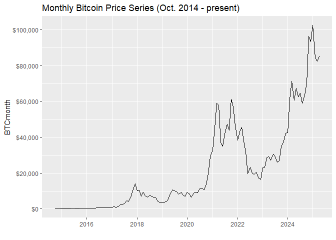
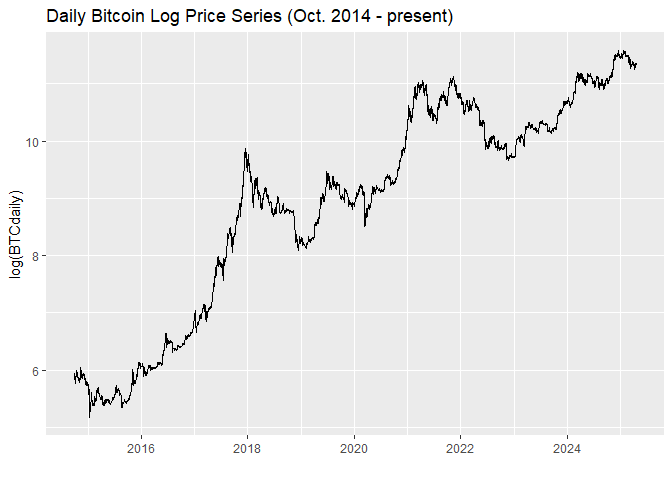
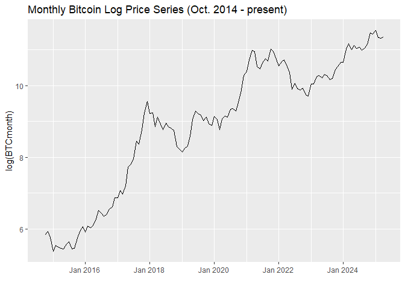
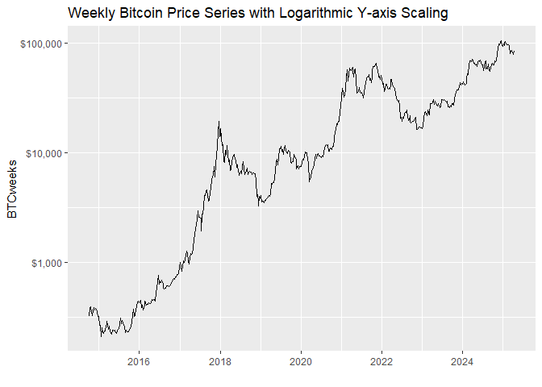
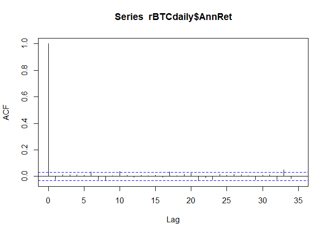
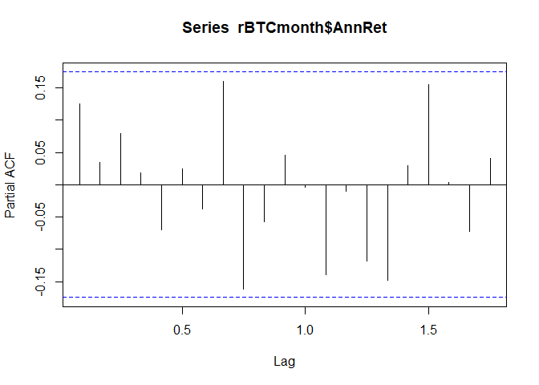
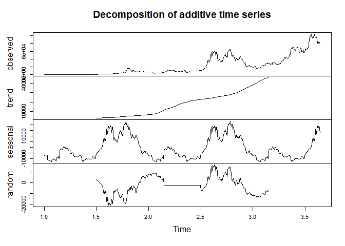
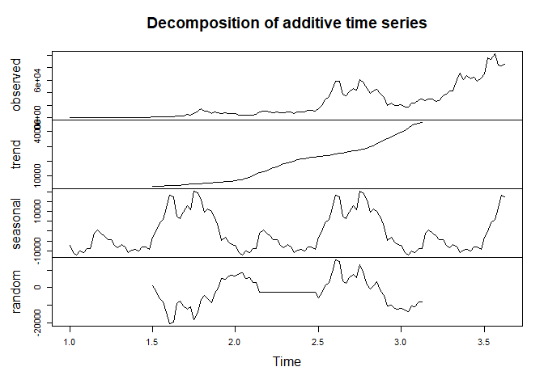

Bitcoin Price Time Series Analysis
================
Last updated: 2025-04-19

## Preliminary Work: Install/Load Packages

To try and ensure that this R Notebook will run successfully, we’ll use
the [renv
package](https://cran.r-project.org/web/packages/renv/index.html) to
create a project-specific library of packages. This will allow us to
install the packages that we need for this project without affecting any
other projects that we may be working on. Additionally, the project
library will track the specific versions of the dependency packages so
that any updates to those packages will not break this project.

The code chunk below will first install the renv package if it is not
already installed. Then we will load the package. Next, we’ll use the
`restore()` function to install any packages listed in the renv.lock
file. Once these packages are installed, we can load them into the R
session using the `library()` commands. Below the code chunk, we’ll list
out the packages that will be used in the project demo. And if you run
into any trouble using renv, then you can use the second code chunk
below and that should be an even more reliable approach to install the
required packages.

``` r
# Install renv package if not already installed
if(!"renv" %in% installed.packages()[,"Package"]) install.packages("renv")
# Load renv package
library(renv)
# Use restore() to install any packages listed in the renv.lock file
renv::restore(clean=TRUE, lockfile="../renv.lock")
# Load in the packages
library(quantmod)
library(tidyverse)
library(scales)
library(tseries)
library(seasonal)
library(seasonalview)
library(rmarkdown)
```

- The [quantmod package](https://cran.r-project.org/package=quantmod)
  contains tools for importing and analyzing financial data.
- The [tidyverse package](https://www.tidyverse.org/) contains a suite
  of packages for data manipulation and visualization.
- The [scales package](https://cran.r-project.org/package=scales) has
  tools for changing the format of axis labels in plots (e.g. dollar
  amounts, percentages, etc.)
- The [tseries package](https://cran.r-project.org/package=tseries)
  contains additional time series analysis functions that we will
  explore.
- The [seasonal package](https://cran.r-project.org/package=seasonal)
  contains an interface to the [Census X-13-ARIMA-SEATS
  model](https://www.census.gov/data/software/x13as.html).
- The [seasonalview
  package](https://cran.r-project.org/package=seasonalview) brings a
  graphical user interface to that Census model.
- The [rmarkdown package](https://cran.r-project.org/package=rmarkdown)
  is used to generate this R Notebook.

Since the rmarkdown functionality is built into RStudio, this last one
is automatically loaded when you open RStudio. So no need to use the
`library()` function for it. Another observation to make about the code
chunk above is that it is labeled as `setup`, which is a special name,
which the R Notebook will recognize and automatically run prior to
running any other code chunk. This is useful for loading in packages and
setting up other global options that will be used throughout the
notebook.

Then if you wish to try and update the versions of the various R
packages in the lock file, you can use the `renv::update()` function to
update the packages in the project library. However, it is possible that
these updates could break the code in this notebook. If so, you may need
to adapt the code to work with the updated packages.

My recommendation is to first run through the code using the versions of
the packages in the lock file. Then if you want to try and update the
packages, you can do so and then run through the code again to see if it
still works. If not, you can always revert back to the lock file
versions using the `renv::restore()` function.

If you update the packages and get everything working successfully, then
you can update the lock file using the `renv::snapshot()` function. This
will update the lock file with the versions of the packages that are
currently installed in the project library. Then you can commit the
updated lock file to the repository so that others can use the updated
versions of the packages.

### Alternative Package Installation Code

If you run into any trouble using renv in the code chunk above, then you
can use the code chunk below to install the required packages for this
analysis. This method will first check if you have already installed the
packages. If any are missing, it will then install them. Then it will
load the packages into the R session. A potential flaw in this approach
compared to using renv is that it will simply install the latest
versions of the packages, which could potentially break some of the code
in this notebook if any of the updates aren’t backwards compatible.

As long as you have downloaded the entire project repository, the renv
chunk above will likely be managing the packages. Thus, the `eval=FALSE`
option is used to prevent this chunk from running unless manually
executed. But if you only downloaded this one Rmd file, this code chunk
should take care of installing the packages for you.

``` r
# Create list of packages needed for this exercise, omit geckor since its not on CRAN
list.of.packages = c("quantmod","tidyverse","scales","tseries","seasonal","seasonalview","rmarkdown")
# Check if any have not yet been installed
new.packages = list.of.packages[!(list.of.packages %in% installed.packages()[,"Package"])]
# If any need to be installed, install them
if(length(new.packages)) install.packages(new.packages)
# Load in the packages
library(quantmod)
library(tidyverse)
library(scales)
library(tseries)
library(seasonal)
library(seasonalview)
library(rmarkdown)
```

### Set Directories and Paths

Set up paths to save data files and other relevant directories:

``` r
# Create general data directory in project root
datadir = "../Data/"
if(!dir.exists(datadir)) dir.create(datadir)
# Create raw data directory within data directory
rawdir = paste0(datadir,"Raw/")
if(!dir.exists(rawdir)) dir.create(rawdir)
# Create a figures directory in project root
figdir = "../Figures/"
if(!dir.exists(figdir)) dir.create(figdir)
```

## Bitcoin Data Import and Cleaning

The `getSymbols()` function from the quantmod package let’s us import
the daily price data for bitcoin. The `src="yahoo"` argument specifies
that we want to pull the data from Yahoo Finance. The `from` and `to`
arguments specify the date range for the data, which goes back to
October 2014 for bitcoin. Rather that assigning a variable name to the
output of `getSymbols()`, the function creates a new variable for each
ticker in the list, named after the ticker. For bitcoin in particular,
the `"BTC-USD"` can be tedious to work with since the presence of a dash
requires one to wrap the variable name in backticks. This is resolved in
the last line of the code chunk below by creating a new variable `BTC`
to be used instead.

``` r
# Set parameters and download data
startdate = "2014-10-01"
tickers = c("BTC-USD")
getSymbols(tickers,
           src="yahoo",
           from=startdate,
           to=Sys.Date())
# Create a copy with a simpler name
BTC = `BTC-USD`
# Save the data to a csv file
write.csv(BTC, file=paste0(rawdir,"BTC_daily_all.csv"), row.names=FALSE)
# Delete old variable to minimize memory usage
rm(`BTC-USD`)
```

If the code chunk above generates an error about missing values, this
can occur due to the most recent observation having a missing value. To
resolve this, we can just filter the data with `complete.cases()`, which
removes any rows with any missing values.

``` r
BTC = BTC[complete.cases(BTC),]
```

Now that we have the daily bitcoin price series, let’s extract the close
prices into a univariate xts object. Then we can rename the column to
`"Close"` to keep variable names simple. After that, let’s aggregate the
daily prices to weekly and monthly series to compare the time series
properties at different frequencies. The xts package (which is a
dependency of quantmod) allows us to easily convert the daily price data
into weekly or monthly OHLC series using `to.weekly()` and
`to.monthly()`. The `name=NULL` option in those functions prevents the
variable names from including the name of the original object.

``` r
# Create daily series and rename column
BTCdaily = BTC$`BTC-USD.Close` 
names(BTCdaily) = "Close"
# Convert to weekly and monthly series
BTCweeksOHLC = to.weekly(BTCdaily$Close, name=NULL)
BTCweeks = BTCweeksOHLC$Close
write.csv(BTCweeks, file=paste0(rawdir,"BTC_weekly_all.csv"), row.names=FALSE)
BTCmonthOHLC = to.monthly(BTCdaily$Close, name=NULL)
BTCmonth = BTCmonthOHLC$Close
write.csv(BTCmonth, file=paste0(rawdir,"BTC_monthly_all.csv"), row.names=FALSE)
```

## Exploring the Full Bitcoin Price Series

### Basic Price Charts

We’ll start with some simple plots of the BTC price series that we
downloaded. Starting with the daily chart, then weekly and monthly. The
[ggplot2 package](https://ggplot2.tidyverse.org/) (part of tidyverse) is
used to generate the plots. The first element of the plot will be a line
chart (`geom_line()`) of the price series. Note that the `index()`
function is used to extract the date index from the xts object for the
plot. Then we’ll clear out the x-axis label with `xlab("")` since the
dates are self-explanatory. The y-axis labels are formatted as dollar
amounts using the `dollar_format()` function from the scales package,
and the `ggtitle()` function is used to add a title to each plot. After
each plot is created, it is displayed in the notebook and then saved
using `ggsave()`. *Note: For the monthly plot, the y input needed to be
formatted back to a Date since the scale package does not appear to be
compatible with the yearmon format.*

``` r
BTCdaily_plot_price = ggplot() +
  geom_line(aes(x=index(BTCdaily),y=BTCdaily)) +
  xlab("") +
  scale_x_date(date_labels="%Y", date_breaks="2 year") +
  scale_y_continuous(labels=dollar_format(), n.breaks=6) +
  ggtitle("Daily Bitcoin Price Series (Oct. 2014 - present)")
BTCdaily_plot_price
```

<!-- -->

``` r
ggsave(paste0(figdir,"BTCdaily_plot_price.pdf"), BTCdaily_plot_price, width=8, height=4)

BTCweeks_plot_price = ggplot() +
  geom_line(aes(x=index(BTCweeks),y=BTCweeks)) +
  xlab("") +
  scale_x_date(date_labels="%Y", date_breaks="2 year") +
  scale_y_continuous(labels=dollar_format(), n.breaks=6) +
  ggtitle("Weekly Bitcoin Price Series (Oct. 2014 - present)")
BTCweeks_plot_price
```

<!-- -->

``` r
ggsave(paste0(figdir,"BTCweeks_plot_price.pdf"), BTCweeks_plot_price, width=8, height=4)

BTCmonth_plot_price = ggplot() +
  geom_line(aes(x=as.Date(index(BTCmonth)),y=BTCmonth)) +
  xlab("") +
  scale_x_date(date_labels="%Y", date_breaks="2 year") +
  scale_y_continuous(labels=dollar_format(), n.breaks=6) +
  ggtitle("Monthly Bitcoin Price Series (Oct. 2014 - present)")
BTCmonth_plot_price
```

<!-- -->

``` r
ggsave(paste0(figdir,"BTCmonth_plot_price.pdf"), BTCmonth_plot_price, width=8, height=4)
```

### Log Price Charts

In regard to statistical analysis of time series data, one drawback of
the directly analyzing the price series above is that they are
*non-stationary*. This property will be explored in more detail below,
but it is visually depicted in the plots above through the observation
that the mean value (and variance) of the series is not constant over
time. To resolve this, we can convert the price series to a stationary
process by taking its derivative (or by differencing the observations
over time to measure price changes/returns). By using log returns, we
effectively assume continuous compounding of the price series, which
reflects the perpetual nature of cryptocurrency markets.

$$r_t = \ln(P_t) - \ln(P_{t-1}) = \ln\left(\dfrac{P_t}{P_{t-1}}\right)$$

The first step in calculating continuously compounded growth rates is to
take the natural logarithm of the prices. To visualize this
transformation, let’s apply two approaches for plotting out the log
price charts. The first approach is to simply compute the log(prices)
within the ggplot specifications. However, note that the scaling on the
y-axis is hard to interpret. The second approach will keep the original
dollar format with logarithmic scaling. Since the second version will be
more intuitive, we won’t bother saving these to files.

``` r
ggplot() +
  geom_line(aes(x=index(BTCdaily), y=log(BTCdaily))) +
  xlab("") +
  ggtitle("Daily Bitcoin Log Price Series (Oct. 2014 - present)")
```

    ## Don't know how to automatically pick scale for object of type <xts/zoo>.
    ## Defaulting to continuous.

<!-- -->

``` r
ggplot() +
  geom_line(aes(x=index(BTCweeks), y=log(BTCweeks))) +
  xlab("") +
  ggtitle("Weekly Bitcoin Log Price Series (Oct. 2014 - present)")
```

    ## Don't know how to automatically pick scale for object of type <xts/zoo>.
    ## Defaulting to continuous.

<!-- -->

``` r
ggplot() +
  geom_line(aes(x=index(BTCmonth), y=log(BTCmonth))) +
  xlab("") +
  ggtitle("Monthly Bitcoin Log Price Series (Oct. 2014 - present)")
```

    ## Don't know how to automatically pick scale for object of type <xts/zoo>.
    ## Defaulting to continuous.

<!-- -->

Alternatively, we can generate the same charts by instead plotting the
non-logged price series with a logarithmic y-axis. This is done in
`ggplot` with the `scale_y_continuous(transform='log10')` setting. Then
the `largest_with_cents=1` argument is added to the `dollar_format()`
function to remove decimals/cents from the y-axis labels.

``` r
BTCdaily_plot_logprice = ggplot() +
  geom_line(aes(x=index(BTCdaily), y=BTCdaily)) +
  scale_x_date(date_labels="%Y", date_breaks="2 year") +
  scale_y_continuous(transform='log10', labels=dollar_format(largest_with_cents=1)) +
  xlab("") +
  ggtitle("Daily Bitcoin Price Series with Logarithmic Y-axis Scaling")
BTCdaily_plot_logprice
```

<!-- -->

``` r
ggsave(paste0(figdir,"BTCdaily_plot_logprice.pdf"), BTCdaily_plot_logprice, width=8, height=4)

BTCweeks_plot_logprice = ggplot() +
  geom_line(aes(x=index(BTCweeks), y=BTCweeks)) +
  scale_x_date(date_labels="%Y", date_breaks="2 year") +
  scale_y_continuous(transform='log10', labels=dollar_format(largest_with_cents=1)) +
  xlab("") +
  ggtitle("Weekly Bitcoin Price Series with Logarithmic Y-axis Scaling")
BTCweeks_plot_logprice
```

<!-- -->

``` r
ggsave(paste0(figdir,"BTCweeks_plot_logprice.pdf"), BTCweeks_plot_logprice, width=8, height=4)

BTCmonth_plot_logprice = ggplot() +
  geom_line(aes(x=as.Date(index(BTCmonth)), y=BTCmonth)) +
  scale_x_date(date_labels="%Y", date_breaks="2 year") +
  scale_y_continuous(transform='log10', labels=dollar_format(largest_with_cents=1)) +
  xlab("") +
  ggtitle("Monthly Bitcoin Price Series with Logarithmic Y-axis Scaling")
BTCmonth_plot_logprice
```

<!-- -->

``` r
ggsave(paste0(figdir,"BTCmonth_plot_logprice.pdf"), BTCmonth_plot_logprice, width=8, height=4)
```

### Log Return Charts

Lastly, we’ll finish the price to return conversion by differencing the
log prices. This can be done directly by composing the `diff()` and
`log()` functions. The `log()` function will take the natural logarithm
of the prices, and then the `diff()` function will subtract the previous
period’s value from the current period’s value. Then to make the series
more comparable, we’ll annualize the returns by multiplying by 365 (for
daily), 52 (for weekly), and 12 (for monthly). Lastly, we’ll adjust the
units to percentages and delete the first observations of each since
those are `NA` due to the differencing.

``` r
# Create data frames with date column
rBTCdaily = data.frame(Date=index(BTCdaily))
rBTCweeks = data.frame(Date=index(BTCweeks))
rBTCmonth = data.frame(Date=index(BTCmonth))
# Compute log returns
rBTCdaily$Return = diff(log(BTCdaily))
rBTCweeks$Return = diff(log(BTCweeks))
rBTCmonth$Return = diff(log(BTCmonth))
# Annualize returns and shift units to percentages
rBTCdaily$AnnRet = rBTCdaily$Return*100*365
rBTCweeks$AnnRet = rBTCweeks$Return*100*52
rBTCmonth$AnnRet = rBTCmonth$Return*100*12
# Remove first row of each data frame (missing due to differencing)
rBTCdaily = rBTCdaily[-1,]
rBTCweeks = rBTCweeks[-1,]
rBTCmonth = rBTCmonth[-1,]
```

With these return series, we resolve much of the non-stationarity
present in the price series. With a more stationary process like
returns, a better way to plot the data is with a bar chart. The average
bar height (red dashed line) represents the average annual return. The
`percent_format()` function from the scales package is used to convert
the y-axis labels to percentages, and the `scale=1` parameter prevents
it from treating the percentage unit variables as decimals.

``` r
BTCdaily_plot_logret = ggplot(rBTCdaily,aes(x=Date,y=AnnRet))+
  geom_col()+
  geom_hline(yintercept=mean(rBTCdaily$AnnRet), linetype='dashed', col='red')+
  xlab("") +
  scale_x_date(date_labels="%Y", date_breaks="2 year") +
  scale_y_continuous(labels=percent_format(scale=1), n.breaks=6) +
  ggtitle("BTC Annualized Daily Returns")
BTCdaily_plot_logret
```

<!-- -->

``` r
ggsave(paste0(figdir,"BTCdaily_plot_logret.pdf"), BTCdaily_plot_logret, width=8, height=4)

BTCweeks_plot_logret = ggplot(rBTCweeks,aes(x=Date,y=AnnRet))+
  geom_col()+
  geom_hline(yintercept=mean(rBTCdaily$AnnRet), linetype='dashed', col='red')+
  xlab("") +
  scale_x_date(date_labels="%Y", date_breaks="2 year") +
  scale_y_continuous(labels=percent_format(scale=1), n.breaks=6) +
  ggtitle("BTC Annualized Weekly Returns")
BTCweeks_plot_logret
```

<!-- -->

``` r
ggsave(paste0(figdir,"BTCweeks_plot_logret.pdf"), BTCweeks_plot_logret, width=8, height=4)

BTCmonth_plot_logret = ggplot(rBTCmonth,aes(x=as.Date(Date),y=AnnRet)) +
  geom_col()+
  geom_hline(yintercept=mean(rBTCmonth$AnnRet), linetype='dashed', col='red')+
  xlab("") +
  scale_x_date(date_labels="%Y", date_breaks="2 year") +
  scale_y_continuous(labels=percent_format(scale=1), n.breaks=6) +
  ggtitle("BTC Annualized Monthly Returns")
BTCmonth_plot_logret
```

<!-- -->

``` r
ggsave(paste0(figdir,"BTCmonth_plot_logret.pdf"), BTCmonth_plot_logret, width=8, height=4)
```

### Summary Statistics

In summarizing the return series, we can compare across the various
frequencies. Since we annualized each series for its respective
frequency, the means represent the average annual returns for BTC.

``` r
meanAnnRets = data.frame(BTCdaily=mean(rBTCdaily$AnnRet), 
                         BTCweeks=mean(rBTCweeks$AnnRet), 
                         BTCmonth=mean(rBTCmonth$AnnRet))
meanAnnRets |> round(digits=2)
```

    ##   BTCdaily BTCweeks BTCmonth
    ## 1    51.17    52.77    52.65

From the volatilities (as measured by standard deviation of the return
series), we can see that the higher frequencies produce larger standard
deviations.

``` r
meanRetVols = data.frame(BTCdaily=sd(rBTCdaily$AnnRet), 
                         BTCweeks=sd(rBTCweeks$AnnRet), 
                         BTCmonth=sd(rBTCmonth$AnnRet))
meanRetVols |> round(digits=2)
```

    ##   BTCdaily BTCweeks BTCmonth
    ## 1  1321.95   499.15   240.02

One way to visualize the empirical distribution summarized by the mean
and standard deviation is to plot a frequency histogram of the return
series overlayed with a normal bell curve transformed by the empirical
mean and standard deviation. The below code chunk first selects a
reasonable bin width (`bw`) for each frequency (trial and error), then
saves a count of non-missing observations, and generates the plot
described above.

``` r
# Set desired binwidth and number of non-missing obs
bw = 500
n_daily = nrow(rBTCdaily)
# Plot histogram of annualized returns and overlay graph of normal bell curve with same means and standard deviation
ggplot(rBTCdaily,aes(AnnRet)) +
  geom_histogram(binwidth=bw) +
  stat_function(fun=function(x) dnorm(x, mean=mean(rBTCdaily$AnnRet),   
                                      sd=sd(rBTCdaily$AnnRet))*n_daily*bw, 
                color="darkred", linewidth=1) +
  xlab("Annualized Daily Growth Rates") +
  scale_x_continuous(labels=percent_format(scale=1)) +
  ylab("Frequency")
```

<!-- -->

``` r
# Same process for weekly series
bw = 100
n_weeks = nrow(rBTCweeks)
ggplot(rBTCweeks,aes(AnnRet)) +
  geom_histogram(binwidth=bw) +
  stat_function(fun=function(x) dnorm(x, mean=mean(rBTCweeks$AnnRet),
                                      sd=sd(rBTCweeks$AnnRet))*n_weeks*bw, 
                color="darkred", linewidth=1) +
  xlab("Annualized Weekly Growth Rates") +
  scale_x_continuous(labels=percent_format(scale=1)) +
  ylab("Frequency")
```

<!-- -->

``` r
# Same process for monthly series
bw = 50
n_month = nrow(rBTCmonth)
ggplot(rBTCmonth,aes(AnnRet)) +
  geom_histogram(binwidth=bw) +
  stat_function(fun=function(x) dnorm(x, mean=mean(rBTCmonth$AnnRet),   
                                      sd=sd(rBTCmonth$AnnRet,))*n_month*bw, 
                color="darkred", linewidth=1) +
  xlab("Annualized Monthly Growth Rates") +
  scale_x_continuous(labels=percent_format(scale=1)) +
  ylab("Frequency")
```

<!-- -->

The plots above show how the daily and weekly return series more closely
resemble the fitted bell curves. However, they do tend to have more tail
events than would be suggested by a normally distributed return series.

## Time Series Stationarity, Autocorrelation, and the Dickey-Fuller Test

A [Stationary](https://search.brave.com/search?q=stationary+time+series)
[Process](https://www.itl.nist.gov/div898/handbook/pmc/section4/pmc442.htm)
is one that has a constant mean, variance, and autocorrelation structure
over time. A [Non-Stationary
Process](https://search.brave.com/search?q=non-stationary+time+series)
can have different aspects of non-stationarity, and financial variables
often exhibit those types of trends. As we could visually see from the
price and return plots, the prices had a clear upward trend over the
long-run, whereas the return series exhibited ‘flatter’ dynamics.

A more explicit way to model and visualize the autocorrelation structure
of the time series is to examine its [autocorrelation function
(ACF)](https://www.itl.nist.gov/div898/handbook/eda/section3/autocopl.htm).
The ACF effectively measures the correlation between $e_t$ and
$e_{t−1}$, and then for $e_t$ and $e_{t−2}$, and so on for as many lags
as desired. In each frequency, the price series exhibits substantial
autocorrelation, and the return series shows that much of it is
resolved, although there still are a few lags that exceed the error
bands.

``` r
acf(as.numeric(BTCdaily))
```

<!-- -->

``` r
acf(rBTCdaily$AnnRet)
```

<!-- -->

``` r
acf(as.numeric(BTCweeks))
```

<!-- -->

``` r
acf(rBTCweeks$AnnRet)
```

<!-- -->

``` r
acf(as.numeric(BTCmonth))
```

<!-- -->

``` r
acf(rBTCmonth$AnnRet)
```

<!-- -->

The [partial autocorrelation function
(PACF)](https://www.itl.nist.gov/div898/handbook/pmc/section4/pmc4463.htm)
is similar to the ACF, except it produces the estimates of each lag
after controlling for all shorter lags. In other words, rather than
measuring the correlation between $e_t$ and $e_{t−2}$, we’d measure the
linear regression coefficient for the second lag from a regression
including both the first and second lags. A notable feature here from
the price series is a very large (nearly 1) estimate, which follows from
the large autocorrelation. Then subsequent lags often fall within the
error bands, although some lags do exceed them. After converting to
returns, the PACF’s have a much more condensed y-axis, which reflects
the lower autocorrelation in the return series. Although, there
certainly are still some lags that cross the error bands for the daily
and weekly series.

``` r
pacf(as.numeric(BTCdaily))
```

<!-- -->

``` r
pacf(rBTCdaily$AnnRet)
```

<!-- -->

``` r
pacf(as.numeric(BTCweeks))
```

<!-- -->

``` r
pacf(rBTCweeks$AnnRet)
```

<!-- -->

``` r
pacf(as.numeric(BTCmonth))
```

<!-- -->

``` r
pacf(rBTCmonth$AnnRet)
```

<!-- -->

From the ACF and PACF, we can gather some visual evidence to support the
suggestion that the price series suffers from autocorrelation
(non-stationarity) and that the return series is stationary. To
explicitly test for this, the
[Augmented](https://search.brave.com/search?q=adf+test)
[Dickey-Fuller](https://www.rdocumentation.org/packages/aTSA/versions/3.1.2/topics/adf.test)
[Test](https://cran.r-project.org/web/packages/tseries/tseries.pdf)
allows us to construct a null hypothesis of non-stationarity, which
implies that rejection of the null concludes stationarity.

The `adf.test()` function from the tseries package generates the test
statistic (Dickey-Fuller in the output) and p-value. We can see that the
price series have smaller (in magnitude) test statistics that fail to
reject the null, and then the return series produce larger (in
magnitude) test statistics that reject the null and conclude that the
return series are a stationary process.

``` r
adf.test(as.numeric(BTCdaily))
```

    ## 
    ##  Augmented Dickey-Fuller Test
    ## 
    ## data:  as.numeric(BTCdaily)
    ## Dickey-Fuller = -1.9035, Lag order = 15, p-value = 0.6192
    ## alternative hypothesis: stationary

``` r
adf.test(rBTCdaily$AnnRet)
```

    ## Warning in adf.test(rBTCdaily$AnnRet): p-value smaller than printed p-value

    ## 
    ##  Augmented Dickey-Fuller Test
    ## 
    ## data:  rBTCdaily$AnnRet
    ## Dickey-Fuller = -14.935, Lag order = 15, p-value = 0.01
    ## alternative hypothesis: stationary

``` r
adf.test(as.numeric(BTCweeks))
```

    ## 
    ##  Augmented Dickey-Fuller Test
    ## 
    ## data:  as.numeric(BTCweeks)
    ## Dickey-Fuller = -2.7002, Lag order = 8, p-value = 0.2819
    ## alternative hypothesis: stationary

``` r
adf.test(rBTCweeks$AnnRet)
```

    ## Warning in adf.test(rBTCweeks$AnnRet): p-value smaller than printed p-value

    ## 
    ##  Augmented Dickey-Fuller Test
    ## 
    ## data:  rBTCweeks$AnnRet
    ## Dickey-Fuller = -7.0673, Lag order = 8, p-value = 0.01
    ## alternative hypothesis: stationary

``` r
adf.test(as.numeric(BTCmonth))
```

    ## 
    ##  Augmented Dickey-Fuller Test
    ## 
    ## data:  as.numeric(BTCmonth)
    ## Dickey-Fuller = -1.2332, Lag order = 5, p-value = 0.8952
    ## alternative hypothesis: stationary

``` r
adf.test(rBTCmonth$AnnRet)
```

    ## Warning in adf.test(rBTCmonth$AnnRet): p-value smaller than printed p-value

    ## 
    ##  Augmented Dickey-Fuller Test
    ## 
    ## data:  rBTCmonth$AnnRet
    ## Dickey-Fuller = -4.7107, Lag order = 4, p-value = 0.01
    ## alternative hypothesis: stationary

If you want to dig deeper into the theory and underlying assumptions
behind these concepts, [Stationarity and Memory in Financial
Markets](https://towardsdatascience.com/non-stationarity-and-memory-in-financial-markets-fcef1fe76053)
has a nice discussion on the topic from a general context of financial
markets.

## Seasonality

### Day-of-Week Seasonality

Another area of concern when it comes to stationarity of a time series
is seasonality. For the data that we have here, the first type of
*season* to explore is day-of-week seasonality. One way to do this is to
generate a count variable ($count=1,2,...,T$), and then calculate the
remainder after dividing by 7. This [modulo
operation](https://en.wikipedia.org/wiki/Modulo_operation) is done with
`%%` in R. Then a quick test for seasonality is to regress the return
series on a factor variable of the remainders. The `as.factor()`
function will transform the numeric variable into a categorical variable
with 7 categories.

Another important piece to note in the second line below is that the
`+6` is used to shift which day of the week is set to the reference
category in the regression model. The 6-day shift was selected by first
running the regression without the shift and examining the estimates for
the day dummies. Since `as.factor(day)1` (Friday) produced the most
negative estimate, the increment of 6 to the count variable by shift
that up to 7, and $7 \mod 7 = 0$.

Thus, after increasing the count, the most negative day will be the
baseline, and all the day dummies should produce a positive coefficient.
This shift will maximize the likelihood that we find a significant
result from the regression by comparing each other day to one of the
extremes. As of April 25, 2025, there is a marginally significant
finding that day=4 (Mondays) tend to out-perform relative to day=0
(Thursdays). *Perhaps one could explore how a strategy around this
observation would perform? Buy at end of Thursday and sell at end of
Monday?*

``` r
rBTCdaily$count = 1:length(rBTCdaily$AnnRet)
rBTCdaily$day = (rBTCdaily$count+6) %% 7
weekreg = lm(AnnRet~as.factor(day),data=rBTCdaily)
summary(weekreg)
```

    ## 
    ## Call:
    ## lm(formula = AnnRet ~ as.factor(day), data = rBTCdaily)
    ## 
    ## Residuals:
    ##      Min       1Q   Median       3Q      Max 
    ## -16953.9   -508.9     -2.0    551.8   8225.6 
    ## 
    ## Coefficients:
    ##                 Estimate Std. Error t value Pr(>|t|)  
    ## (Intercept)       -8.742     56.314  -0.155   0.8766  
    ## as.factor(day)1   83.500     79.640   1.048   0.2945  
    ## as.factor(day)2   65.725     79.640   0.825   0.4093  
    ## as.factor(day)3   16.432     79.676   0.206   0.8366  
    ## as.factor(day)4  166.392     79.676   2.088   0.0368 *
    ## as.factor(day)5    8.205     79.676   0.103   0.9180  
    ## as.factor(day)6   79.219     79.676   0.994   0.3202  
    ## ---
    ## Signif. codes:  0 '***' 0.001 '**' 0.01 '*' 0.05 '.' 0.1 ' ' 1
    ## 
    ## Residual standard error: 1322 on 3846 degrees of freedom
    ## Multiple R-squared:  0.001672,   Adjusted R-squared:  0.0001144 
    ## F-statistic: 1.073 on 6 and 3846 DF,  p-value: 0.3759

In addition to testing for seasonality, we can also include the count
variable as a linear time trend to see if returns are systematically
changing over time. As seen below, this loads slightly negative and very
insignificant.

``` r
weekreg2 = lm(AnnRet~count+as.factor(day),data=rBTCdaily)
summary(weekreg2)
```

    ## 
    ## Call:
    ## lm(formula = AnnRet ~ count + as.factor(day), data = rBTCdaily)
    ## 
    ## Residuals:
    ##      Min       1Q   Median       3Q      Max 
    ## -16953.4   -510.3     -2.0    553.0   8219.9 
    ## 
    ## Coefficients:
    ##                   Estimate Std. Error t value Pr(>|t|)  
    ## (Intercept)       5.592586  67.320588   0.083   0.9338  
    ## count            -0.007443   0.019148  -0.389   0.6975  
    ## as.factor(day)1  83.507804  79.648590   1.048   0.2945  
    ## as.factor(day)2  65.739922  79.648597   0.825   0.4092  
    ## as.factor(day)3  16.428413  79.684784   0.206   0.8367  
    ## as.factor(day)4 166.395577  79.684784   2.088   0.0368 *
    ## as.factor(day)5   8.215834  79.684789   0.103   0.9179  
    ## as.factor(day)6  79.237393  79.684798   0.994   0.3201  
    ## ---
    ## Signif. codes:  0 '***' 0.001 '**' 0.01 '*' 0.05 '.' 0.1 ' ' 1
    ## 
    ## Residual standard error: 1322 on 3845 degrees of freedom
    ## Multiple R-squared:  0.001711,   Adjusted R-squared:  -0.0001064 
    ## F-statistic: 0.9415 on 7 and 3845 DF,  p-value: 0.4729

The models above show the decomposition of an observed time series into
(1) a trend component, (2) a seasonal component, (3) and a random
(residual/error) component. The `decompose()` function separates a time
series into those components and can be used to product an easy visual
plot of the decomposition. In the first line, the annual return series
is transformed into a time series object using the `ts()` function,
which has better compatibility with the `decompose()` function. The
`frequency=7` allows us to set the period cycle for seasonality to be
seven days in a week. Then the time component is indexed by weeks since
the start of the data series, as seen in the plots below.

``` r
BTCdailyts = ts(as.numeric(BTCdaily), frequency=7)
BTCdailytsdecomp = decompose(BTCdailyts)
plot(BTCdailytsdecomp)
```

<!-- -->

### Day-of-Year Seasonality

A more common approach to seasonality is to model the time of the year
to capture the impact of actual seasons. This can be done with the daily
price series; however, since the regression model would output
coefficients for all the 364 day dummy variables, we’ll just generate
the time series decomposition plot. One additional parameter we can
include in this case is indicating the starting point of the data. Since
this is an annual cycle, the first numeric input is the starting year,
and the 274 is derived from the first observation on October 1, which
was the 274th day of year in 2014. *An potential flaw here may be the
handling of leap years. I’m not sure that the tseries package is
correctly handling leap years when the frequency is set to 365. It is
likely just modeling a 365-day cycle, so every leap year will shift the
particular dates by 1.*

``` r
BTCdayyearts = ts(as.numeric(BTCdaily), frequency=365, start=c(2014,274))
BTCdayyeartsdecomp = decompose(BTCdayyearts)
plot(BTCdayyeartsdecomp)
```

<!-- -->

### Month-of-Year Seasonality

The next level to test for seasonality at is for each month of the year.
Similar to above, we create a count in the monthly data frame, calculate
$count \mod 12$ with a 1-month shift (to adjust the baseline to the
worst month), and then regress the returns on a factor variable of the
remainders. As of April 25, 2025, there is a marginally significant
finding that month=1 (October) tends to out-perform relative to month=0
(September). *How would a “Buy Sept 1, Sell Oct 31” strategy perform?*

``` r
rBTCmonth$count = 1:length(rBTCmonth$AnnRet)
rBTCmonth$month = (rBTCmonth$count+1) %% 12
monthreg = lm(AnnRet~as.factor(month),data=rBTCmonth)
summary(monthreg)
```

    ## 
    ## Call:
    ## lm(formula = AnnRet ~ as.factor(month), data = rBTCmonth)
    ## 
    ## Residuals:
    ##     Min      1Q  Median      3Q     Max 
    ## -616.61 -131.16   -3.57  136.22  609.30 
    ## 
    ## Coefficients:
    ##                    Estimate Std. Error t value Pr(>|t|)  
    ## (Intercept)         -33.812     75.611  -0.447   0.6556  
    ## as.factor(month)1   258.237    106.930   2.415   0.0173 *
    ## as.factor(month)2   107.138    104.472   1.026   0.3073  
    ## as.factor(month)3   105.062    104.472   1.006   0.3167  
    ## as.factor(month)4     1.573    104.472   0.015   0.9880  
    ## as.factor(month)5   160.346    104.472   1.535   0.1276  
    ## as.factor(month)6    17.074    104.472   0.163   0.8705  
    ## as.factor(month)7   120.892    104.472   1.157   0.2496  
    ## as.factor(month)8    87.937    106.930   0.822   0.4126  
    ## as.factor(month)9    33.053    106.930   0.309   0.7578  
    ## as.factor(month)10  131.800    106.930   1.233   0.2203  
    ## as.factor(month)11   15.044    106.930   0.141   0.8884  
    ## ---
    ## Signif. codes:  0 '***' 0.001 '**' 0.01 '*' 0.05 '.' 0.1 ' ' 1
    ## 
    ## Residual standard error: 239.1 on 114 degrees of freedom
    ## Multiple R-squared:  0.09495,    Adjusted R-squared:  0.007621 
    ## F-statistic: 1.087 on 11 and 114 DF,  p-value: 0.3778

Similar to the daily series, the linear time trend of the monthly series
is not statistically significant.

``` r
monthreg2 = lm(AnnRet~count+as.factor(month),data=rBTCmonth[rBTCmonth$Date!=as.yearmon("Nov 2013"),])
summary(monthreg2)
```

    ## 
    ## Call:
    ## lm(formula = AnnRet ~ count + as.factor(month), data = rBTCmonth[rBTCmonth$Date != 
    ##     as.yearmon("Nov 2013"), ])
    ## 
    ## Residuals:
    ##     Min      1Q  Median      3Q     Max 
    ## -620.59 -131.12  -13.17  134.61  599.37 
    ## 
    ## Coefficients:
    ##                    Estimate Std. Error t value Pr(>|t|)  
    ## (Intercept)        -12.2834    84.9266  -0.145   0.8853  
    ## count               -0.3312     0.5881  -0.563   0.5744  
    ## as.factor(month)1  258.5683   107.2536   2.411   0.0175 *
    ## as.factor(month)2  105.8127   104.8125   1.010   0.3149  
    ## as.factor(month)3  104.0681   104.8009   0.993   0.3228  
    ## as.factor(month)4    0.9103   104.7927   0.009   0.9931  
    ## as.factor(month)5  160.0143   104.7877   1.527   0.1295  
    ## as.factor(month)6   17.0738   104.7861   0.163   0.8709  
    ## as.factor(month)7  121.2236   104.7877   1.157   0.2498  
    ## as.factor(month)8   86.6122   107.2777   0.807   0.4212  
    ## as.factor(month)9   32.0590   107.2665   0.299   0.7656  
    ## as.factor(month)10 131.1373   107.2584   1.223   0.2240  
    ## as.factor(month)11  14.7130   107.2536   0.137   0.8911  
    ## ---
    ## Signif. codes:  0 '***' 0.001 '**' 0.01 '*' 0.05 '.' 0.1 ' ' 1
    ## 
    ## Residual standard error: 239.8 on 113 degrees of freedom
    ## Multiple R-squared:  0.09748,    Adjusted R-squared:  0.001642 
    ## F-statistic: 1.017 on 12 and 113 DF,  p-value: 0.4382

Now let’s plot out the full time series decomposition of the monthly
series. Since this is one of the more meaningful decompositions we’ll
generate, the final three lines below will create a high-quality output
of the plot in a pdf format.

``` r
BTCts_Close = ts(as.numeric(BTCmonth), frequency=12, start=c(2014,10))
BTCtsdecomp = decompose(BTCts_Close)
plot(BTCtsdecomp)
```

<!-- -->

``` r
# Create output pdf file for the plot, plot it, and save file.
pdf(paste0(figdir,"BTCtsdecomp_month_year.pdf"), width=6)
plot(BTCtsdecomp)
dev.off()
```

    ## png 
    ##   2

### Bitcoin Halving Seasonality

One feature of the Bitcoin protocol is the reduction in block rewards
that occurs every four years. Specifically, this fixed portion of mining
rewards that are new bitcoins being mined into existence get reduced by
50% every 210,000 blocks. Since the mining process produces a new block
every 10 minutes, this translates to roughly 4 years.

$1 halving = 210,000 blocks \cdot \dfrac{10min}{1block} \cdot \dfrac{1hr}{60min} \cdot \dfrac{1day}{24hr} = 1,458days+8hr = 208.\overline{33}weeks = 3.995years$

In addition to not exactly measuring 4 years, there is the additional
variation around the 10 minute-per-block timing in the short-term. The
Bitcoin protocol has a difficulty adjustment that takes effect every
2,016 blocks (\$\$14 days). This automatic adjustment allows the mining
difficulty to adapt to changes in network hash rate without impacting
the block timing, which enables Bitcoin’s algorithmic monetary
inflation.

So there isn’t quite a clean way to split the halving timeline into
perfect cycles at any of the frequencies. But we can round to the
nearest whole number and see what we get with each.

#### Daily Halving Seasonality

The Bitcoin halving cycle is closest to 1,458 days, so lets examine the
time series decomposition with that frequency. Since the decomposition
charts transform the date component to cycle-time, the points below
transform the halving dates to the corresponding time values on the
chart.

- 2012 Halving (Nov. 28, block 210,000): No price data yet
- 2016 Halving (July 9, block 420,000): `dayhalf`=647 $\implies$
  Time=1.44
- 2020 Halving (May 11, block 630,000): `dayhalf`=591 $\implies$
  Time=2.41
- 2024 Halving (April 20, block 840,000): `dayhalf`=573 $\implies$
  Time=3.39
- 2028 Halving (March?, block 1,050,000): `dayhalf`=??? $\implies$
  Time=4.??

Since we just added 1,457 dummy variables to the regression model, it is
not surprising that absorbed much of the volatility. This is also why we
don’t display the summary of the results. Then the lack of three full
cycles leads to a flat period in the residual (random). This is expected
since some of the estimates are based on only two observations. As time
moves on and more halvings are experienced, any seasonality around this
cycle should become more apparent.

``` r
rBTCdaily$dayhalf = rBTCdaily$count %% 1458
dailyhalfreg = lm(AnnRet~count+as.factor(dayhalf),data=rBTCdaily)
BTCdailyhalfts = ts(as.numeric(BTCdaily), frequency=1458)
BTCdailyhalftsdecomp = decompose(BTCdailyhalfts)
plot(BTCdailyhalftsdecomp)
```

<!-- -->

#### Weekly Halving Seasonality

Similarly, we can modeling this halving seasonality at the weekly
frequency. The halving cycle is closest to 208 weeks, so we’ll use that
as the frequency for the time series decomposition. Overall, we see
similar trends as with the daily data. Similar to the daily
decomposition chart, the dates are transformed to cycle-time. So the
points below transform the halving dates to the corresponding time
values on the chart.

- 2012 Halving (Nov. 28, block 210,000): No price data yet
- 2016 Halving (July 9, block 420,000): `weekhalf`=92 $\implies$
  Time=1.44
- 2020 Halving (May 11, block 630,000): `weekhalf`=85 $\implies$
  Time=2.41
- 2024 Halving (April 20, block 840,000): `weekhalf`=82 $\implies$
  Time=3.39
- 2028 Halving (March?, block 1,050,000): `weekhalf`=??? $\implies$
  Time=4.??

``` r
rBTCweeks$count = 1:length(rBTCweeks$AnnRet)
rBTCweeks$weekhalf = rBTCweeks$count %% 208
weekshalfreg = lm(AnnRet~count+as.factor(weekhalf),data=rBTCweeks)
BTCweekshalfts = ts(as.numeric(BTCweeks), frequency=208)
BTCweekshalftsdecomp = decompose(BTCweekshalfts)
plot(BTCweekshalftsdecomp)
```

<!-- -->

#### Monthly Halving Seasonality

Since the monthly halving cycle is only 48 months, let’s also generate
the regression estimates to check for some significant months in a
halving cycle. As with the other frequencies, the points below transform
the halving dates to cycle-time. Then let’s also save this plot as a
pdf.

- 2012 Halving (Nov. 28, block 210,000): No price data yet
- 2016 Halving (July 9, block 420,000): `monthhalf`=21 $\implies$
  Time=1.44
- 2020 Halving (May 11, block 630,000): `monthhalf`=19 $\implies$
  Time=2.40
- 2024 Halving (April 20, block 840,000): `monthhalf`=18 $\implies$
  Time=3.38
- 2028 Halving (March?, block 1,050,000): `monthhalf`=?? $\implies$
  Time=4.??

``` r
BTCmonthhalfts = ts(as.numeric(BTCmonth), frequency=48)
BTCmonthhalftsdecomp = decompose(BTCmonthhalfts)
plot(BTCmonthhalftsdecomp)
```

<!-- -->

``` r
rBTCmonth$monthhalf = rBTCmonth$count %% 48
monthhalfreg = lm(AnnRet~count+as.factor(monthhalf),data=rBTCmonth)
summary(monthhalfreg)
```

    ## 
    ## Call:
    ## lm(formula = AnnRet ~ count + as.factor(monthhalf), data = rBTCmonth)
    ## 
    ## Residuals:
    ##     Min      1Q  Median      3Q     Max 
    ## -567.96 -103.27   -1.37   88.11  567.96 
    ## 
    ## Coefficients:
    ##                         Estimate Std. Error t value Pr(>|t|)  
    ## (Intercept)              36.0083   169.9542   0.212   0.8328  
    ## count                    -0.4525     0.5841  -0.775   0.4409  
    ## as.factor(monthhalf)1  -221.3776   213.0113  -1.039   0.3019  
    ## as.factor(monthhalf)2  -122.8775   212.9753  -0.577   0.5657  
    ## as.factor(monthhalf)3   -65.2393   212.9408  -0.306   0.7601  
    ## as.factor(monthhalf)4    93.6692   212.9080   0.440   0.6612  
    ## as.factor(monthhalf)5    79.9635   212.8767   0.376   0.7082  
    ## as.factor(monthhalf)6    91.8912   212.8471   0.432   0.6671  
    ## as.factor(monthhalf)7   138.2536   212.8190   0.650   0.5179  
    ## as.factor(monthhalf)8   180.8931   212.7926   0.850   0.3979  
    ## as.factor(monthhalf)9   -23.4043   212.7677  -0.110   0.9127  
    ## as.factor(monthhalf)10 -161.2991   212.7445  -0.758   0.4507  
    ## as.factor(monthhalf)11  -43.1039   212.7228  -0.203   0.8400  
    ## as.factor(monthhalf)12  247.3975   212.7028   1.163   0.2484  
    ## as.factor(monthhalf)13   20.5331   212.6843   0.097   0.9233  
    ## as.factor(monthhalf)14   70.0543   212.6675   0.329   0.7427  
    ## as.factor(monthhalf)15   38.4131   212.6523   0.181   0.8571  
    ## as.factor(monthhalf)16  173.0750   212.6386   0.814   0.4182  
    ## as.factor(monthhalf)17  -80.6883   212.6266  -0.379   0.7054  
    ## as.factor(monthhalf)18   76.5888   212.6162   0.360   0.7197  
    ## as.factor(monthhalf)19  140.5969   212.6073   0.661   0.5104  
    ## as.factor(monthhalf)20   45.9728   212.6001   0.216   0.8294  
    ## as.factor(monthhalf)21   63.1854   212.5945   0.297   0.7671  
    ## as.factor(monthhalf)22  -61.3196   212.5905  -0.288   0.7738  
    ## as.factor(monthhalf)23   15.8464   212.5881   0.075   0.9408  
    ## as.factor(monthhalf)24  191.7067   212.5873   0.902   0.3700  
    ## as.factor(monthhalf)25  290.1639   212.5881   1.365   0.1763  
    ## as.factor(monthhalf)26  243.5606   212.5905   1.146   0.2555  
    ## as.factor(monthhalf)27   90.4210   212.5945   0.425   0.6718  
    ## as.factor(monthhalf)28  123.0201   212.6001   0.579   0.5645  
    ## as.factor(monthhalf)29   58.2043   212.6073   0.274   0.7850  
    ## as.factor(monthhalf)30   95.1945   212.6162   0.448   0.6556  
    ## as.factor(monthhalf)31   44.1928   233.0893   0.190   0.8501  
    ## as.factor(monthhalf)32    0.2843   233.0651   0.001   0.9990  
    ## as.factor(monthhalf)33  181.6575   233.0424   0.780   0.4381  
    ## as.factor(monthhalf)34  360.4789   233.0212   1.547   0.1260  
    ## as.factor(monthhalf)35 -102.2922   233.0014  -0.439   0.6619  
    ## as.factor(monthhalf)36  432.7503   232.9831   1.857   0.0671 .
    ## as.factor(monthhalf)37  223.0769   232.9663   0.958   0.3413  
    ## as.factor(monthhalf)38   62.0215   232.9509   0.266   0.7908  
    ## as.factor(monthhalf)39 -313.9655   232.9370  -1.348   0.1817  
    ## as.factor(monthhalf)40   72.5197   232.9246   0.311   0.7564  
    ## as.factor(monthhalf)41 -214.5587   232.9136  -0.921   0.3598  
    ## as.factor(monthhalf)42   49.6399   232.9041   0.213   0.8318  
    ## as.factor(monthhalf)43 -233.8748   232.8960  -1.004   0.3184  
    ## as.factor(monthhalf)44 -384.1487   232.8894  -1.649   0.1031  
    ## as.factor(monthhalf)45  211.1032   232.8843   0.906   0.3675  
    ## as.factor(monthhalf)46 -155.6337   232.8806  -0.668   0.5059  
    ## as.factor(monthhalf)47  -58.8630   232.8784  -0.253   0.8011  
    ## ---
    ## Signif. codes:  0 '***' 0.001 '**' 0.01 '*' 0.05 '.' 0.1 ' ' 1
    ## 
    ## Residual standard error: 232.9 on 77 degrees of freedom
    ## Multiple R-squared:  0.4201, Adjusted R-squared:  0.05863 
    ## F-statistic: 1.162 on 48 and 77 DF,  p-value: 0.2747

``` r
# Create output pdf file for the plot, plot it, and save file.
pdf(paste0(figdir,"BTCtsdecomp_month_half.pdf"), width=6)
plot(BTCmonthhalftsdecomp)
dev.off()
```

    ## png 
    ##   2

### A Deeper Dive on Seasonality

So far, we have just used some fairly basic seasonality tools from the
tseries package. A more in-depth package focused around seasonal
adjustments for time series data is the seasonal package. The `seas()`
function will output the main results from the X-13 ARIMA-SEATS seasonal
adjustment method. If you wish to explore this model in more detail,
uncomment the `view()` function in the code chunk below to generate a
shiny dashboard that allows you to interact with the model. This
dashboard is a local version of
[seasonal.website](http://www.seasonal.website/). See the [Introduction
to Seasonal](http://www.seasonal.website/seasonal.html) page for more
info.

``` r
BTCts_Close |> seas() ##|> view()
```

    ## 
    ## Call:
    ## seas(x = BTCts_Close)
    ## 
    ## Coefficients:
    ## AR-Nonseasonal-01  
    ##             0.164

The above output shows us some of the results from the time series model
that was estimated (X-13 ARIMA-SEATS). This is identified even for the
price model because the return transformation that we did effectively
represents the “I” in the ARIMA of the model name. That “I” stands for
“integrated” in the longer acronym of [AutoRegressive Integrated Moving
Average](https://search.brave.com/search?q=arima). Thus, if you switch
from “Original and Adjusted Series” to the option directly below with a
(%), that will transform the graph to the same shape as the return
series, but without the annualization.

``` r
BTCts_AnnRet = ts(rBTCmonth$AnnRet, frequency=12, start=c(2014,11))
BTCts_AnnRet |> seas() ## |> view()
```

    ## 
    ## Call:
    ## seas(x = BTCts_AnnRet)
    ## 
    ## Coefficients:
    ##          Constant  AR-Nonseasonal-01  
    ##           52.7179             0.1244
